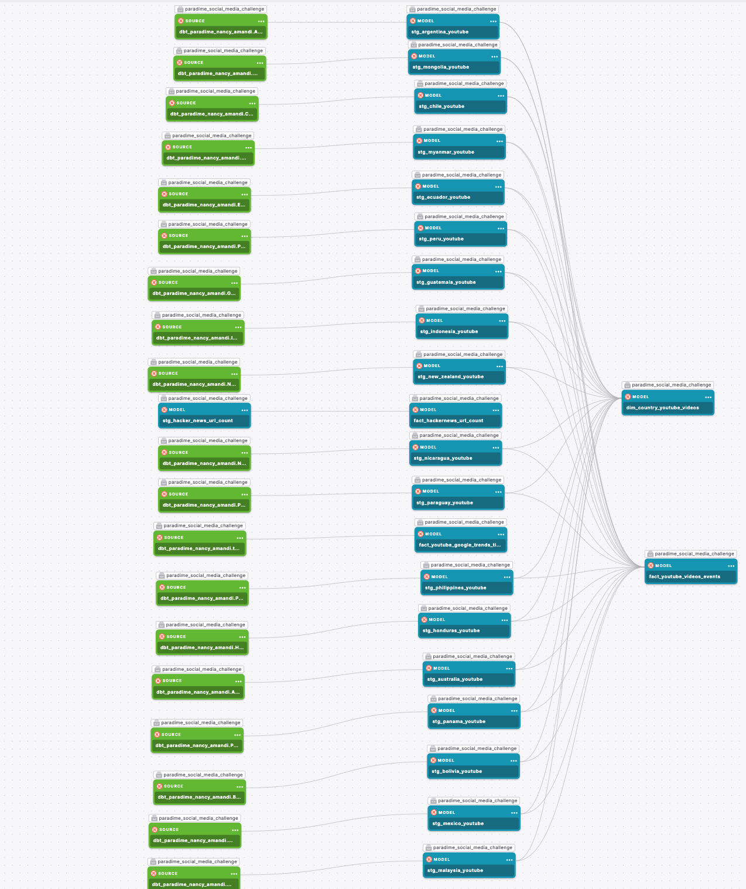
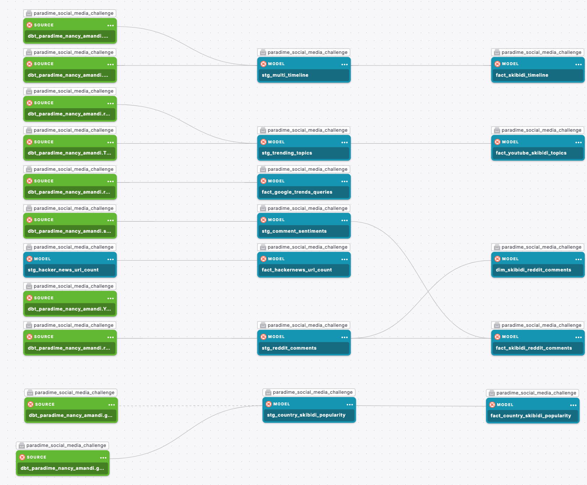
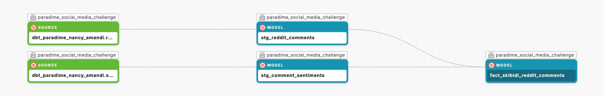

# dbt™ Data Modeling Challenge - Social Media Edition

Welcome to the [dbt™ Data Modeling Challenge - Social Media Edition](https://www.paradime.io/dbt-data-modeling-challenge)! This challenge showcases my data modeling skills using social media data.

## 📋 Table of Contents

1. [Introduction](#introduction)
2. [Data Sources](#data-sources)
   - [Data Lineage](#data-lineage)
3. [Methodology](#methodology)
   - [Tools Used](#tools-used)
   - [Data Preparation Techniques](#data-preparation-techniques)
4. [Insights](#insights)
   - [YouTube: A Platform That Stands Out](#youtube-a-platform-that-stands-out)
   - [The Unlikely Star of YouTube: Skibidi Toilet](#the-unlikely-star-of-youtube-skibidi-toilet)
   - [A Newcomer with Staying Power](#a-newcomer-with-staying-power)
   - [Surprise: It’s All About the Songs](#surprise-its-all-about-the-songs)
   - [Songs: The King of YouTube Content](#songs-the-king-of-youtube-content)
   - [The Geographic Divide: Skibidi Toilet’s Popularity](#the-geographic-divide-skibidi-toilets-popularity)
   - [Entertainment Reigns Supreme in the South](#entertainment-reigns-supreme-in-the-south)
   - [Entertainment Dominates YouTube’s Landscape](#entertainment-dominates-youtubes-landscape)
   - [Top 5 Channel: DaFuq!?Boom!](#top-5-channel-dafuqboom)
   - [High Engagement Beyond YouTube](#high-engagement-beyond-youtube)
   - [Sentiment Shift: A Recent Dip](#sentiment-shift-a-recent-dip)
   - [Reddit’s Take: Skibidi Toilet Resonates with a Younger Audience](#reddits-take-skibidi-toilet-resonates-with-a-younger-audience)
5. [Conclusions](#conclusions)
6. [Recommendations](#recommendations)

## Introduction

- How do people get upto 1M views on their youtube channels?

- How can I have a youtube channel that could fetch thousands of dollars?

- Why is my youtube channel subscribers not running into hundreds of thousands of subscribers?

If you've had questions like these on your mind, then we might be on the same page? Whether you're thinking of having a youtube channel or already have a youtube channel that's stuck on low views, low subscribers and low engagement in general, this analysis could change your perspective about the usual youtube channel and move you to having an unusual youtube channel (one with millions of engagements). So how about we dig in and get into the analysis right away...

## Data Sources

My analysis was based on data sources from Paradime and other sources.

The Paradime data source includes the hackernews data provided in the competition.

Additional Data Sources:

- [Youtube Data API](https://developers.google.com/youtube/v3) where data metrics from different youtube channels across different countries were extracted. Thanks to [@Mithelljy](https://github.com/mitchelljy) for his [Trending Youtube Scraper Python Script](https://github.com/mitchelljy/Trending-YouTube-Scraper/blob/master/scraper.py)

- [Google Trends Data](https://trends.google.com/trends/)

- [Python Reddit API Wrapper](https://praw.readthedocs.io/en/stable/) where reddit data was extracted using my python script. This python script also did some sentiment analysis on the comments and posts extracted based on my specific keyword.

### Data Lineage

Listed below is the data lineage for some of the models:

## Methodology

### Tools Used:

- [Paradime](https://www.paradime.io/) for SQL, dbt modeling

- [Hex](https://hex.tech/) for data visualization

- [Motherduck](https://motherduck.com/) for data storage

- Python for data extraction and sentiment analysis

- Microsoft Excel to transform data gotten from Google Trends before moving them into Motherduck

### Data Preparation Techniques

- Selected distinct values in various data sources pulled into Motherduck to prevent duplicate values

- Use of dbt tests to test for uniqueness and desired relationships between tables

- Ensured structured header layout of csv files gotten from Google Trends

- Merged the different countries youtube data extracted from the Youtube data api into one table using dbt while using a 'country' flag column to distinguish the data coming from different countries

- Carried out sentiment analysis on reddit posts and comments using python

- converted columns into their respective data types to aid analysis

## Insights

To have a more interactive dive into my insights, you can visit [my Hex App](https://app.hex.tech/e6c00971-5b65-4681-a8cb-b90ada70d712/app/da170203-740a-4676-8f76-467ac4e5ed64/latest).

## How Skibidi Toilet Flushed Its Way to Youtube Fame

*Get insights from this project on how an animation came from nowhere to steal the show on Youtube. Insights derived from this project can help you own your fame on Youtube.*

### YouTube: A Platform That Stands Out

Among the most frequented platforms on HackerNews, YouTube ranks high, second only to GitHub. It's hardly a surprise that GitHub, a hub for technology enthusiasts and entrepreneurs, claims the top spot. However, YouTube's strong presence is equally significant, especially as a leading learning resource for those in technology.

**But what’s driving YouTube’s success in recent years?**

When we look at YouTube search trends from 2021 to the present, the picture changes dramatically. You might assume that tech-related queries dominate the scene, but the reality may surprise you.

This unexpected change is what drove the narrative of this data story.  Come with me as we explore this narrative together!

### The Unlikely Star of YouTube: Skibidi Toilet

According to data from Google Trends between 2021 and now, 'Skibidi toilet' has been a trending search query on Youtube. 

You may not have heard of *Skibidi Toilet*, but this peculiar term has been a YouTube sensation. 

Let’s dive into what exactly it is. According to Wikipedia:

> Skibidi Toilet is a machinima web series released through YouTube videos and shorts, created by Alexey Gerasimov and uploaded on his YouTube channel DaFuq!?Boom!. Produced using Source Filmmaker, the series follows a fictional war between human-headed toilets and humanoid characters with electronic devices for heads.

Odd, right? And yet, Skibidi Toilet has held its ground on the trending charts since it first appeared.

### A Newcomer with Staying Power

Posted in February 2023, Skibidi Toilet quickly rose in popularity, dominating YouTube search trends just weeks after its debut. Though its fame may have slightly waned, it still outpaces many long-standing popular search queries. 

This raises an interesting question: **What exactly are people searching for?**

### Surprise: It’s All About the Songs

One of the driving forces behind Skibidi Toilet’s rise is its music. People aren’t just watching the bizarre animation; they’re searching for the songs in the series. 

This suggests something bigger. **Can we generalize that songs, in all formats, are among the most searched content on YouTube?**

## Songs: The King of YouTube Content

It’s clear that songs hold a commanding lead over other formats on YouTube. In fact, the gap between songs and movies (the second most popular search format) is striking. Interestingly, the plural form of "songs" also appears among the top five search queries.

But who is searching for these songs, or even something as niche as Skibidi Toilet songs?

MintTwist once said, “One of the biggest mistakes on YouTube is creating videos that nobody is searching for.” The creators of Skibidi Toilet seem to have nailed their audience’s interests, sparking a surge of searches. 

**But what nationalities are most engaged with this content?**

### The Geographic Divide: Skibidi Toilet’s Popularity

For a more interactive map. Visit [this link](https://app.hex.tech/e6c00971-5b65-4681-a8cb-b90ada70d712/app/da170203-740a-4676-8f76-467ac4e5ed64/latest?selectedStaticCellId=7d782ae3-9c78-40ea-9310-9a57bd94b94b)

There’s a clear divide in the global appeal of Skibidi Toilet. North and South American countries are leading in searches, with Australia close behind. 

This trend raises another question: **Is the broader category of Entertainment equally popular in these regions?**

### Entertainment Reigns Supreme in the South

For a more interactive map, visit [this link](https://app.hex.tech/e6c00971-5b65-4681-a8cb-b90ada70d712/app/da170203-740a-4676-8f76-467ac4e5ed64/latest?selectedStaticCellId=0c51ca64-6da8-4de3-ae24-78b0b69b83ec)

Though data on broader entertainment Youtube trends in the world is limited, there’s enough to suggest that mostly South America have a significant interest in entertainment-focused YouTube content.

**How does this category stack up against other genres on the platform?**

### Entertainment Dominates YouTube’s Landscape

When looking at the average views per video, Entertainment continues to lead all other YouTube categories. 

The Entertainment category encompasses a wide range of content—everything from viral videos, vlogs, comedy skits, to music and pop culture. It’s the catch-all for content designed primarily to amuse and engage viewers, which explains why it consistently dominates in terms of views.

However, the margin between Entertainment and Science & Technology is smaller than one might expect. This highlights how diverse audience interests on YouTube truly are, with people engaging both with light-hearted entertainment and more educational content.

But let’s return to Skibidi Toilet. **How does the channel behind this viral trend compare to other top-performing YouTube creators?**

### Top 5 Channel: DaFuq!?Boom!

DaFuq!?Boom!, the creator of Skibidi Toilet, now ranks among YouTube’s top five channels based on average views per video. Here’s a quick look at the channels and their longevity:

- MrBeast - 12 years ago

- UNILAD - 6 years ago

- Meow-some! Reacts - October 2023

- Ben Azelart - 8 years ago

- DaFuq?!Boom! - 7 years ago

Despite its relatively recent success, DaFuq!?Boom! is holding its own against much older, more established channels. With continued focus on engaging content, there’s potential for it to climb even higher.

Onto Our Next Question... 

**Is the buzz around Skibidi Toilet confined to YouTube, or is it sparking conversations beyond the platform?**

### High Engagement Beyond YouTube

Surprisingly, Skibidi Toilet is not just a YouTube phenomenon—it’s generating significant traction on Reddit as well. With a Reddit post score of 2,873 and an impressive upvote ratio of 0.883, it’s clear that people are engaging positively with the content. The high number of upvotes, compared to downvotes, suggests a generally favorable reception among Redditors.

The comment score of 12 also highlights a respectable level of interaction within the discussions, adding another layer of engagement.

However, there’s an interesting twist. Despite all the buzz, the sentiment score for Skibidi Toilet remains nearly neutral. So, while the engagement is strong, people’s feelings about it are more mixed than you might expect.

**Has this neutral sentiment been the norm, or did it shift over time?**

### Sentiment Shift: A Recent Dip

Sentiment around Skibidi Toilet has fluctuated, and a notable dip in June 2024 has yet to recover. 

**Could the series be losing its edge, or is this just a natural cycle of online content?**

### Reddit’s Take: Skibidi Toilet Resonates with a Younger Audience

An analysis of Reddit discussions reveals that Skibidi Toilet primarily resonates with younger audiences, particularly Gen Alpha. 

With keywords like "kids" and "like" standing out in these discussions, it’s clear that the bizarre charm of human-headed toilets appeals to the next generation.

## Conclusion

- **Youtube's Role in Tech and Entertainment:** Youtube remains a critical platform for both learning and entertainment. While it’s no surprise that Github leads among Hackernews users, Youtube’s position as second highlights its dual nature as a platform used for both tech education and mainstream entertainment.

- **Shift in Youtube's Search Trends:** Youtube's trending content has increasingly shifted towards entertainment, with non-technical videos like Skibidi Toilet gaining significant popularity. This reflects a broader cultural shift, where entertainment-focused content now dominates the platform's search trends.

- **Dominance of Songs as a Content Format:** Songs and music-related content consistently rank among the top Youtube searches, revealing the platform's appeal as a music discovery and entertainment hub. This reaffirms that Youtube serves a wide audience beyond just instructional or educational content.

- **Regional Popularity of Entertainment Content:** 'Skibidi Toilet' and entertainment videos, in general, have gained significant traction in North and South American regions. This highlights a cultural divide in Youtube preferences, with entertainment being favored more in these regions compared to others.

- **Potential for Content Growth:** The DaFuq!?Boom! channel's success with 'Skibidi Toilet' indicates that content tailored toward a specific, niche audience (such as Gen Alpha) can rapidly grow and even challenge long-established Youtube channels. This shows the potential for rapid growth with the right content strategy.

- **Sentiment Decline:** Despite initial popularity, the sentiment towards 'Skibidi Toilet' has dipped in recent months, possibly signaling audience fatigue or changing expectations. It’s an important reminder that even viral content needs continual innovation to maintain its momentum.

## Recommendations

- **Leverage Cross-Platform Engagement:** Brands and content creators looking to replicate the success of Skibidi Toilet should focus on fostering engagement across multiple platforms, like Reddit and YouTube. Cross-promotion will help sustain a viral phenomenon beyond its initial surge.

- **Monitor Sentiment Trends:** Although engagement is high, the neutral sentiment score hints that Skibidi Toilet may not enjoy sustained positive attention without adjustments. Tracking sentiment over time and making content tweaks based on audience feedback can prevent further dips in popularity.

- **Tap into Younger Audiences:** Content creators aiming for viral success should take note of Skibidi Toilet’s appeal to Gen Alpha. Developing content that resonates with this demographic—combining humor, animation, and music—could be key to unlocking new engagement opportunities.

- **Experiment with Unconventional Formats:** The unexpected rise of something as niche as Skibidi Toilet shows the value of experimenting with non-traditional content formats. Brands and creators should be bold in exploring quirky, experimental ideas that might captivate underserved audiences.

- **Target Regional Audiences with Entertainment:** Brands and content creators could leverage the popularity of entertainment content in North and South America by tailoring their content strategies to appeal more to these regions. This could include adapting formats, language, and cultural references. Also, brands could study their desired audiences to see the kind of youtube categories they are interested in.