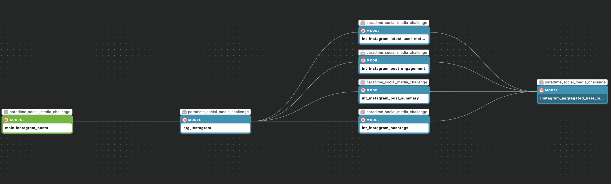

# dbt™ Data Modeling Challenge - Social Media Edition
# Instagram Post Engegament Analysis
Created by [Alex Vajda](https://www.linkedin.com/in/alexandra-vajda)

## Table of Contents
1. [Introduction](#introduction)
2. [Data Sources](#data-sources)
3. [Methodology](#methodology)
4. [Insights](#insights)
5. [Conclusions](#conclusions)

### Introduction
This project focuses on analysing user engagement metrics on Instagram using a dataset of posts and user information. The analysis aims to uncover insights into how different factors—such as the number of followers, following, and hashtags—affect engagement levels across various types of content.
The project involves building a series of data models using dbt, integrating user and post-level data, and visualising key engagement trends. The final analysis provides a comprehensive overview of user behaviour, post characteristics, and engagement patterns.

## Data Sources & Data Lineage
Dataset containing 600,000 Instagram posts between 2012 and 2019. [Source:](https://huggingface.co/datasets/vargr/main_instagram?row=73)

## Methodology 
### Tools Used
- Paradime: SQL and dbt™ development
- MotherDuck: Data storage and computing
- Hex: Data visualization
- Python & SQL
- ChatGPT for ideation

### Applied Techniques
- 

## Insights

### Insight 1
- Title
- Visualization
- Analysis

## Conclusions
[Summarize key findings and their implications]
