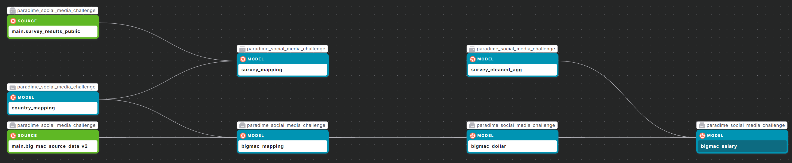
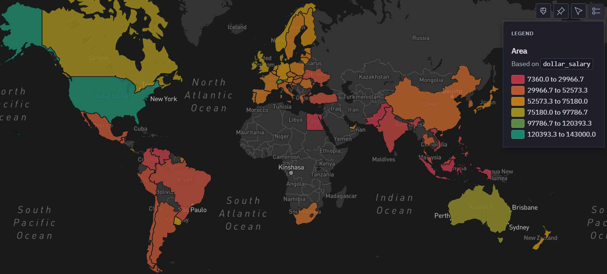
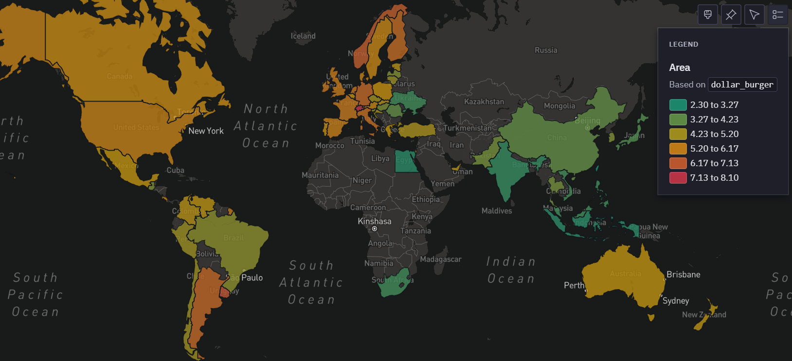
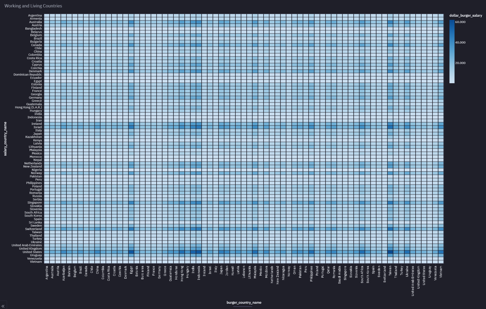

# Social Media Data Analysis - dbt™ Modeling Challenge

## Table of Contents
1. [Introduction](#introduction)
2. [Data Sources](#data-sources)
3. [Methodology](#methodology)
4. [Insights](#insights)
5. [Conclusions](#conclusions)

## Introduction
Goal: Combining Stack Overflow Salary Data with the Big Mac Index to Estimate Purchasing Power

In this analysis, the aim is to estimate the purchasing power of software developers by combining two distinct datasets: salary data from Stack Overflow’s developer survey and the Big Mac Index published by The Economist. The Stack Overflow survey provides detailed salary information for developers across various countries, while the Big Mac Index offers a measure of the relative cost of a Big Mac burger in different countries, serving as a proxy for purchasing power parity (PPP).

By integrating these datasets, one can calculate how many Big Macs a developer’s salary can buy in different countries. This approach allows to compare the real value of salaries globally, adjusting approximately for local cost of living. The resulting insights can help developers understand their relative earning potential and inform decisions about job opportunities and relocations.

## Data Sources
- Dataset 1 (*survey dataset*): Stack Overflow Developer Survey 2024 - A comprehensive survey that gathers insights from developers worldwide on various topics such as technology usage, work habits, salary and community trends. The data was supplied from the official Stack Overflow site: [The 2024 Developer Survey - Meta Stack Overflow](https://meta.stackoverflow.com/questions/430298/the-2024-developer-survey).
- Dataset 2 (*bigmac dataset*) : Big Mac Index July 2024 -  An informal measure of purchasing power parity (PPP) between different currencies, created by The Economist in 1986, which compares the price of a Big Mac burger in various countries to determine the relative value of currencies. The data was supplied from the official Github repository of The Economist:  [TheEconomist/big-mac-data: Data and methodology for the Big Mac index (github.com)](https://github.com/TheEconomist/big-mac-data)

### Data Lineage
Data lineage image:

## Methodology
### Tools Used
- Paradime: SQL and dbt™ development
- MotherDuck: Data storage and computing
- Hex: Data visualization

### Applied Techniques

**Data Cleansing:**

- **Survey Dataset:**
  - The dataset includes two columns for salary data: "*CompTotal*" (local currency) and "*ConvertedCompYearly*" (USD). The "*ConvertedCompYearly*" column contained empty values marked as "*NA*" which were removed. 
  As stated in the methodology section, salaries were converted from local currencies to USD using the exchange rate on June 11, 2024 [Methodology | 2024 Stack Overflow Developer Survey](https://survey.stackoverflow.co/2024/methodology/#general).

- **Big Mac Dataset:**
  - The provided data is clean and well-formatted. The most recent dataset, from July 2024, was selected for further analysis.

- **Countries Considered:**
  - A total of 58 countries with at least 20 responses were included. Guatemala had the fewest responses with 21, while the United States had the most with 4,677 developers.

**Key Measures:**

- The median was used to compare values in the aggregated data, as it is less sensitive to outliers compared to the average.

## Insights

### Survey Salary 
**Salary Distribution Across Countries**

Unsurprisingly, companies in the United States offer the highest median salary at $143k USD. Following at a distance are Israel and Switzerland, with median salaries of approximately $110k USD. 
At the lower end of the scale, Indonesia, Pakistan, and Egypt offer median salaries ranging from $7k to $9k USD per year.

")

One could argue that a high income generally increases purchasing power. However, a high income might still only afford a mediocre standard of living due to high costs of living. 
This insight cannot be derived from salary data alone; other factors, such as a price index, must be considered.

Examining the geographical distribution of developer salaries reveals clusters of high-income regions, such as North America, Europe, and Oceania. In contrast, regions in Asia, Africa, South America, and the Middle East show lower median salaries.

### Big Mac Price

**Big Mac Price Distribution Across Countries**

- The Big Mac Index is a simple, informal way to measure purchasing power parity (PPP) between different currencies. Introduced by The Economist in 1986, 
it uses the price of a Big Mac as a benchmark because it is a standardized product available in many countries. For example, if a Big Mac costs $5 in the US and £4 in the UK, 
the implied exchange rate would be 1.25 ($5/£4). By comparing local prices of Big Macs, the index helps determine whether a currency is undervalued or overvalued relative to the US dollar.
- This index provides an easy-to-understand comparison of the cost of living and currency values, highlighting differences in pricing and economic conditions across countries.
- However, it does not account for many factors influencing exchange rates, such as trade policies, market speculation, and economic conditions. 
The index is based on a single product, which may not represent the overall economy.

The highest price for a Big Mac is paid by customers in Switzerland at $8.1 USD, followed by Uruguay and Norway at about $7 USD. 
At the lower end of the scale, Taiwan, Indonesia, Egypt, and India have prices ranging from $2.3 to $2.7 USD.

")

These prices provide a simple way to estimate living costs and the purchasing power of a country's residents. Following this, Switzerland would be the most expensive place to live, 
while Taiwan would be the cheapest. The question then becomes: how many Big Macs can a resident afford if they work as a developer in that country with the median salary?

In terms of living costs, Europe shows relatively high prices, while lower prices can be found in Asia, Africa, and the Middle East.

### Purchasing Power for Salaries 

**The Big Mac Salary as a Measure of Purchasing Power**

The basic idea is to adjust the nominal salary in each country by the Big Mac Index to understand what that salary is really worth in terms of purchasing power.

$$\text{Big Mac Salary} = \frac{\text{Survey Salary in USD}}{\text{Big Mac Price in USD}}$$

- **Survey Salary**: The median salary for each country from the Stack Overflow survey in USD, converted from local currency by the data provider.
- **Big Mac Price**: A measure of how expensive it is to live in each country, typically provided in USD by the data provider.

This measurement gives us the number of Big Macs that the nominal salary can buy. The higher this number, the greater the purchasing power of the salary.

**Example Calculation**

Let’s consider a simplified example to illustrate the process:

- *Country A (Switzerland):*
  - Survey Salary: $111,417 USD/year
  - Big Mac Price: $8.10 USD
  - Big Mac Salary: $\frac{111,417}{8.1} = 13,755$ burgers/year
  
- *Country B (Canada):*
  - Survey Salary: $87,231 USD/year
  - Big Mac Price: $5.50 USD
  - Big Mac Salary: $\frac{87,231}{5.5} = 15,860$ burgers/year

In this example, even though Switzerland has a higher nominal salary, the adjusted salary indicates that in terms of purchasing power (using the Big Mac as a proxy), Switzerland is not as advantageous as it might seem compared to Canada. This reflects the higher cost of living in Switzerland.

")

The highest Big Mac Salaries, i.e., the number of Big Mac burgers a developer can afford with a median salary, are found in Israel and the United States, with roughly 25k burgers per year. Surprisingly, although Israel has a significantly lower median salary compared to the US (a difference of about $30k USD), it also has a lower cost of living, with a Big Mac price of $4.5 USD compared to $5.7 USD in the US.

Switzerland, on the other hand, has the highest cost of living, where a resident developer can afford only 13.7k burgers/year despite having the third-largest median salary. Developers in Indonesia and Egypt have some of the lowest median salaries but also the lowest cost of living, resulting in a purchasing power of 2.9k and 3.8k burgers/year, respectively.

Developers in Venezuela and Pakistan have the lowest purchasing power, with 2.1k and 2.2k burgers/year. Venezuela has a relatively high Big Mac price of $5 USD, higher than that of Israel, while also having the fourth-lowest median salary for developers at about $10.8k USD per year.

Taiwan is a notable exception with 13.4k burgers/year. With the lowest cost of living for resident developers (a Big Mac price of $2.3 USD) and a median salary of about $30.8k USD/year, developers in Taiwan may enjoy purchasing power comparable to that in Switzerland.

In terms of purchasing power, regions such as North America, Europe, and Oceania display high values, in addition to East Asia, encompassing countries like Japan and China.

### Combine Work and Living Considerations

To determine the best combination of working in one country and living in another the following measure is introduced.

**Composite Score**:
	For each pair of work and live countries the potential purchasing power by considering how much of the work country’s salary could be spent in the living country:
	
  $$\text{Composite Score} = \frac{\text{Survey Salary in Work Country}}{\text{Big Mac Price in Live Country}}$$

  This score indicates how many Big Macs you could buy if you earned a salary in one country and lived in another, giving you a measure of the best work-live combination.

The best combination for this would be the United States as work country with a median salary of 143k USD and Taiwan the live country with the lowest cost of living measured by the Bif Mac price of 2.3 USD. 
Thus resulting in a purchasing power of 62k burgers per year, which is 2.5 times higher than in the United States. 

However, apart from the purchasing power other factors play a significant role for quality of live in a live country such as criminal rates, housing etc., which have not been considered in this study.

## Conclusions
High Salaries vs. Cost of Living: High nominal salaries do not always translate to high purchasing power due to varying costs of living.
Purchasing Power: Israel and the United States offer the highest purchasing power for developers, while Venezuela and Pakistan offer the lowest.
Optimal Work-Live Combination: The best scenario for maximizing purchasing power is earning a salary in the United States and living in Taiwan.
Additional Factors: Other quality-of-life factors, such as crime rates and housing, should also be considered when evaluating the best places to live and work.

This method might be valuable for digital nomads, who can better understand the real value of salaries across different countries and maximize their standard of living by considering both where they work and live.
