# Social Media Olympics 2024 - dbt™ Data Modeling Challenge

Project for the dbt™ Data Modeling Challenge - Social Media Edition, Hosted by Paradime!

*by **✋ [Bruno Souza de Lima](https://www.linkedin.com/in/brunoszdl/)***

## Table of Contents

1. [Introduction](#introduction)
2. [🗂️ Data Sources](#️-data-sources)
   - [Olympic Games 2024 Official API 🏅](#olympic-games-2024-official-api-)
   - [SocialBlade Metrics (Historical Data) 📈](#socialblade-metrics-historical-data-)
   - [Social Media Platforms Metrics 🌐](#social-media-platforms-metrics-)
   - [Tweets from Twitter/X 🐦](#tweets-from-twitterx-)
   - [Posts and Comments from Reddit 💬](#posts-and-comments-from-reddit-)
   - [Google Trends 🔍](#google-trends-)
   - [Seeds](#seeds)
3. [🔗 Data Lineage](#-data-lineage)
   - [Staging Layer](#staging-layer)
   - [Intermediate Layer](#intermediate-layer)
   - [Marts Layer](#marts-layer)
   - [Exposures](#exposures)
4. [🛠️ Methodology](#%EF%B8%8F-methodology)
   - [Tools Used](#tools-used)
   - [Applied Techniques](#applied-techniques)
5. [📊 Dashboards](#-dashboards)
   - [Analyses](#analyses)
   - [Events and Results](#events-and-results)
6. [🎉 Wrapping It Up](#-wrapping-it-up)

## Introduction
**Welcome to the Social Media Olympics 2024! 🏅**
Imagine if the 11,000+ athletes competing at the Paris 2024 Olympic Games were also competing for gold in a Social Media Olympics!

Which Athletes would win the following events?
- **Instagram**: Followers 📸
- **TikTok**: Followers, Follower Growth, Likes, and Like Growth 🎵📈
- **Twitter/X**:  Followers and Follower Growth 🐦⬆️
- **YouTube**: Subscribers, Subscriber Growth, Video Views, and Video View Growth 🎥🔥
- **Tweet** Mentions: Number of mentions on Twitter/X 🗣️🐤
- **Reddit** Mentions: Number of mentions on Reddit 🟠💬

And beyond just the numbers, what drives an athlete's social media growth? How do fans react and engage?

Explore who’s the champions both on the field and across social media in these games of digital influence! 🎉

*Powered by **Paradime, MotherDuck and Hex**!*

## 🗂️ Data Sources
Data was gathered from the following sources and seeds:

### Sources:

#### Olympic Games 2024 Official API 🏅
There's an official Olympic Games API, with official entries for the athletes and sports.
- `raw.athletes_bio`: A JSON containing bio information of athletes, including personal details, **social media accounts**, participation, and results.
  This JSON was put together by getting all the Athlete's codes from the **MIS_Athletes endpoint** (https://olympics.com/OG2024/data/MIS_Athletes~comp=OG2024~lang=ENG~functionCategory=A.json), and then using the codes to get each Athlete's info from the **CIS_Bio_Athlete endpoint** (https://olympics.com/OG2024/data/CIS_Bio_Athlete~comp=OG2024~code={code}~lang=ENG.json).

- `raw.sports`: JSON containing a list of disciplines with their codes, descriptions, and sport status, extracted from the **MIS_Sports endpoint** (https://olympics.com/OG2024/data/MIS_Sports~comp=OG2024~lang=ENG.json).

#### SocialBlade metrics (Historical Data) 📈
[SocialBlade](https://socialblade.com/) was selected as a source due to its **historical data (30 days of information)**, which is valuable for understanding how athletes' social media presence grew during the Olympic Games. The following data was extracted via web scraping python scripts:

- `raw.socialblade_twitter_metrics`: Number of Followers and Tweets for the current date and for 30 days ago for the athlete's Twitter/X accounts.
- `raw.socialblade_tiktok_metrics`: Number of Followers and Likes for the current date and for 30 days ago for the athlete's TikTok accounts.
- `raw.socialblade_youtube_metrics`: Number of Subscribers and Video Views for the current date and for 30 days ago for the athlete's YouTube accounts.

🚫 **Limitations**:
  - Unfortunately, SocialBlade makes it **difficult to scrape Instagram data**, as it blurs the information and requires authentication. Therefore, **Instagram data was not extracted from SocialBlade**, making it the only social media platform in this project without historical data.
  - **SocialBlade does not cover all YouTube and TikTok accounts**, making it necessary to scrape data from the original websites. For Twitter/X, it was possible to obtain data for all existing athletes' accounts.

#### Social Media Platforms metrics 🌐
Due to SocialBlade's limitations, the social media platforms' websites were scraped to get Instagram information and information for TikTok and YouTube accounts that were not available in SocialBlade.

- `raw.instagram_metrics` 📸: Current number of followers for Athlete's [Instagram](https://www.instagram.com/) accounts.
- `raw.tiktok_metrics` 🎵: Current number of followers and likes for Athlete's [TikTok](https://www.tiktok.com/) accounts.
- `raw.youtube_metrics` 🎥: Current number of subscribers and video views for Athlete's [YouTube](https://www.youtube.com/) accounts.

#### Tweets from Twitter/X 🐦
[X (Twitter)](https://x.com/) was scraped to collect tweets about the Olympic Games.
- `raw.tweets`: 100,000 tweets in English, containing the hashtags #Olympics or #Paris2024, from 2024-07-27 to 2024-08-10 (the opening and closing ceremonies were excluded to focus on tweets about sports and athletes, not the ceremonies). A sentiment analysis python script was used to classify the tweets in a range from negative to positive.

#### Posts and comments from Reddit 💬
The [Olympics subreddit](https://reddit.com/r/Olympics) was scraped to collect posts and comments about the Olympics.
- `raw.reddit_posts_and_comments`: 452 posts and around 8,000 comments from the `/r/Olympics subreddit`, from 2024-07-18 to 2024-08-18 (This interval is because of the limited time range options for the scraper). A sentiment analysis python script was used to classify the posts and comments in a range from negative to positive.

#### Google Trends 🔍
[Google Trends](https://trends.google.com.br/trends/) was scraped using [pytrends](https://pypi.org/project/pytrends/).
- `raw.google_trends_sports_normalized`: Trends for the Olympic sports during the Olympic Games (2024-07-26 to 2024-08-11).

🚫 **Limitations**:
  - Famous sports not related to the Olympics could interfere with the comparison. So, the word 'Olympics' was added to the name of each sport when requesting the trending metric, e.g., "Basketball Olympics".
  - The official name for Soccer in the Olympics is Football. So, the word "Soccer Olympics" was added to the list of terms.
  - Google Trends allows only 5 terms per comparison. To overcome this problem, the term 'Olympics' was in every set of 5 terms, and it was used as the reference to normalize all trends.

### Seeds:
- `dbt_bsouzadelima_seeds.country_codes`: A `.csv`file containing country codes, names, continents and emoji flags.

- `dbt_bsouzadelima_seeds.youtube_channels`: A `.csv` file matching athletes' codes with channel ids/names.

## 🔗 Data Lineage

The project structure followed the [dbt Labs' best practices](https://docs.getdbt.com/best-practices/how-we-structure/1-guide-overview).
### Staging Layer
Materialized as `views`, a staging model was created 1:1 to each source, to select the necessary columns, perform renaming, casting (if needed), reordering and light transformation.
- `dbt_bsouzadelima_staging.stg_olympics_api__athletes_bio`
- `dbt_bsouzadelima_staging.stg_olympics_api__sports`
- `dbt_bsouzadelima_staging.stg_web_scraping__google_trends_sports_normalized`
- `dbt_bsouzadelima_staging.stg_web_scraping__instagram_metrics`
- `dbt_bsouzadelima_staging.stg_web_scraping__reddit_posts_and_comments`
- `dbt_bsouzadelima_staging.stg_web_scraping__socialblade_tiktok_metrics`
- `dbt_bsouzadelima_staging.stg_web_scraping__socialblade_twitter_metrics`
- `dbt_bsouzadelima_staging.stg_web_scraping__socialblade_youtube_metrics`
- `dbt_bsouzadelima_staging.stg_web_scraping__tiktok_metrics`
- `dbt_bsouzadelima_staging.stg_web_scraping__tweets`
- `dbt_bsouzadelima_staging.stg_web_scraping__youtube_metrics`
### Intermediate Layer
Materialized as `ephemeral`, an intermediate model was created to reuse code across different models on the marts layer.
- `dbt_bsouzadelima_intermediate.int_athletes_bio_pivoted`

### Marts Layer
Materialized as `tables`, it was created dimension tables for athletes, sports and countries, and fact tables for metrics of each Social Media Platform.
- `dbt_bsouzadelima_marts.dim_athletes`
- `dbt_bsouzadelima_marts.dim_countries`
- `dbt_bsouzadelima_marts.dim_sports`
- `dbt_bsouzadelima_marts.fct_google_trends`
- `dbt_bsouzadelima_marts.fct_instagram_metrics`
- `dbt_bsouzadelima_marts.fct_reddit_posts_and_comments`
- `dbt_bsouzadelima_marts.fct_tiktok_metrics`
- `dbt_bsouzadelima_marts.fct_tweets`
- `dbt_bsouzadelima_marts.fct_twitter_metrics`
- `dbt_bsouzadelima_marts.fct_youtube_metrics`

### Exposures
To add the dashboard to the dbt`s lineage view, an exposure was created to represent it.
- `social_media_olympics_2024`

## 🛠️ Methodology
### Tools Used
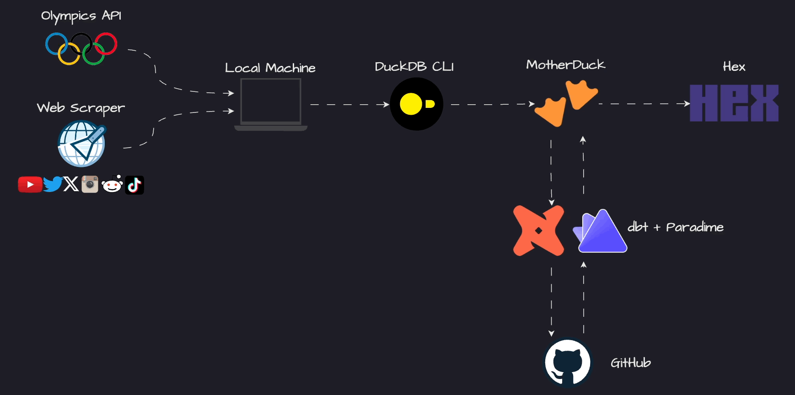
- [**Paradime**](https://app.us.paradime.io/home): SQL and dbt™ development
- [**MotherDuck**](https://motherduck.com/): Data storage and computing
- [**Hex**](https://hex.tech/): Data visualization
- **Python** for extracting/creating sources and seeds:
    - [beautifulsoup](https://pypi.org/project/beautifulsoup4/) for scraping socialblade and social media platforms.
    - [pytrends](https://pypi.org/project/pytrends/) for google trends scraping.
    - [textblob](https://pypi.org/project/textblob/0.9.0/) for sentiment analysis.
    - [pycountry](https://pypi.org/project/pycountry/) for country details.
- [**DuckDB CLI**](https://duckdb.org/docs/api/cli/overview.html) for loading local data into MotherDuck
- [**dbt bult-in tests**](https://docs.getdbt.com/docs/build/data-tests) and [**dbt-expectations**](https://github.com/calogica/dbt-expectations) for data quality.

### Applied Techniques
#### Getting source data
All source was get from the Web through web scraping in some way.
##### Requesting Data
Some websites return HTTP 429 errors or block access when attempting to scrape their data. To mitigate this, some basic web scraping techniques were employed, such as:
- Changing the user-agent
- Implementing time intervals between requests
##### Input for Social Media Scraping
The input for social media scraping is the athlete's account username or ID, which is retrieved from the Olympics API. The API provides the account URL, from which the username or ID must be extracted.

However, the URL information is manually filled out by the athlete or someone on their behalf, and it is not always correct.

The URLs come in different formats: some include "https://", some do not; some use "twitter.com", others use "x.com"; some use "youtube.com/c/username", others "youtube.com/channel/channel_id", or even "youtube.com/@username".

Occasionally, URLs contain additional parameters, complicating the extraction of usernames, and sometimes the URLs refer to the wrong platform.

To address these issues, the following were used:
- Python scripts to resolve most problems
- Manual checks for fine-tuning
##### Loading source data
Since all source data was within `.json` or `.csv` files, DuckDB was used to load data into motherduck following this [guide](https://motherduck.com/docs/key-tasks/loading-data-into-motherduck/loading-data-from-local-machine/).

#### Preparing/Cleaning Data
- SQL and dbt were used to unnest and parse JSON data.
- SQL and dbt were utilized to merge different staging models for the same social media platform.
- SQL and dbt were employed to deduplicate source data using `SELECT DISTINCT`.

#### Transforming Data
Most metrics were already in the final format, such as the number of followers and likes, but some needed to be created:
- Growth rate during the Olympics was calculated as `followers_30_days / (followers - followers_30_days)`.
- The columns `is_medalist`, `is_gold_medalist`, `is_silver_medalist`, and `is_bronze_medalist` were created from the medals info provided by the API.
- The column `num_of_events` was created based on the registered events info from the API.
- SQL, dbt, and Star Schema modeling were used to create fact and dimension tables.

#### Visualizing Data
- SQL inside Hex was used to create queries for the charts. Using the star schema, every query involved joining a fact table with one or more dimension tables and aggregating data as needed.
- **For most analyses it was used `median` instead of `average`. Median is less affected by extreme outliers and skewness, and the social media data analysed is highly skewed.**

## 📊 Dashboards

[Published Dashboard Link](https://app.hex.tech/97a2cfe2-8e02-474f-98d0-92397730cd27/app/f33cabdf-9c89-47e7-be9c-0ccb5df7c3e6/latest)

**Welcome to the Social Media Olympics 2024! 🏅**

Discover which of the athletes competing in the Paris 2024 Olympic Games are taking home gold, silver, and bronze medals in these social media events:

Which Athletes would win the following events?
- **Instagram**: Followers 📸
- **TikTok**: Followers, Follower Growth, Likes, and Like Growth 🎵📈
- **Twitter/X**:  Followers and Follower Growth 🐦⬆️
- **YouTube**: Subscribers, Subscriber Growth, Video Views, and Video View Growth 🎥🔥
- **Tweet** Mentions: Number of mentions on Twitter/X 🗣️🐤
- **Reddit** Mentions: Number of mentions on Reddit 🟠💬

Explore who’s the champions both on the field and across social media in these games of digital influence! 🎉

But first, let's go through some interesting analyses!

### Analyses
#### General Statistics
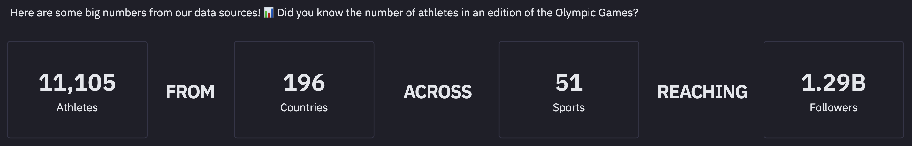
#### Top Metrics
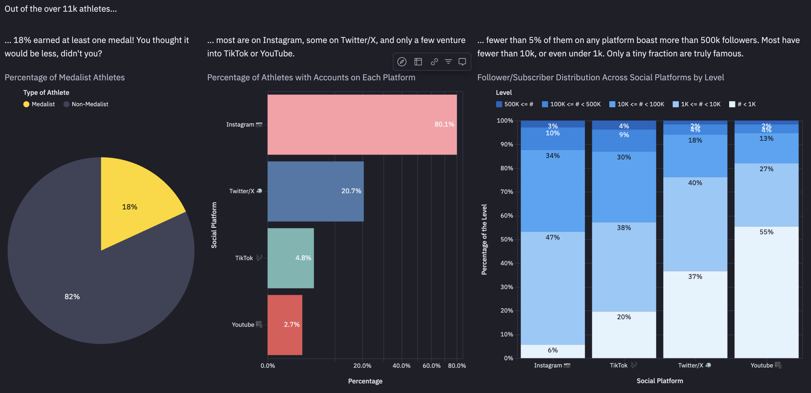
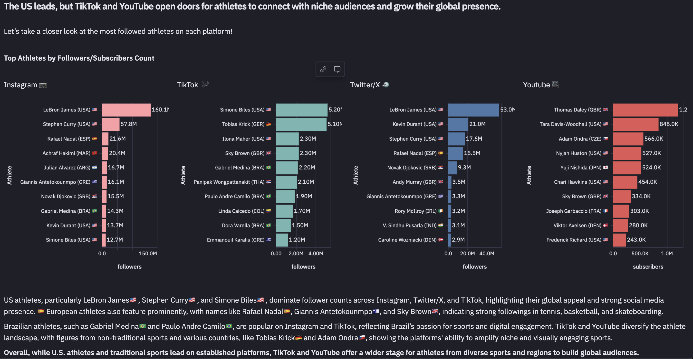
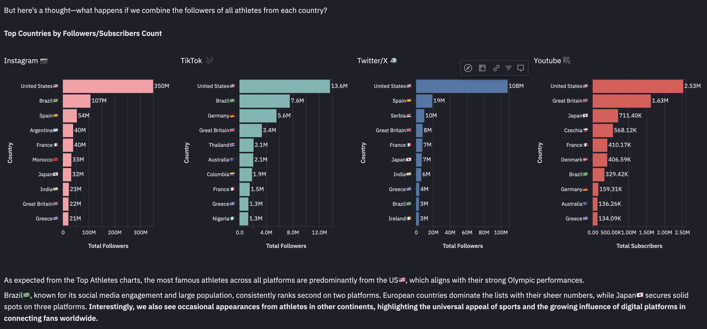
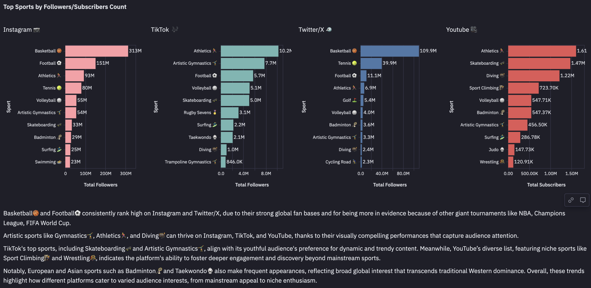
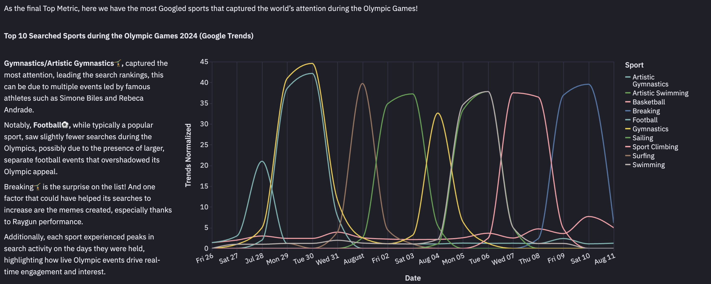
#### Followers and Growth
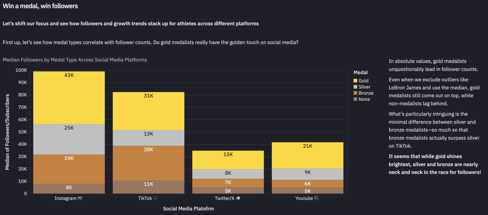

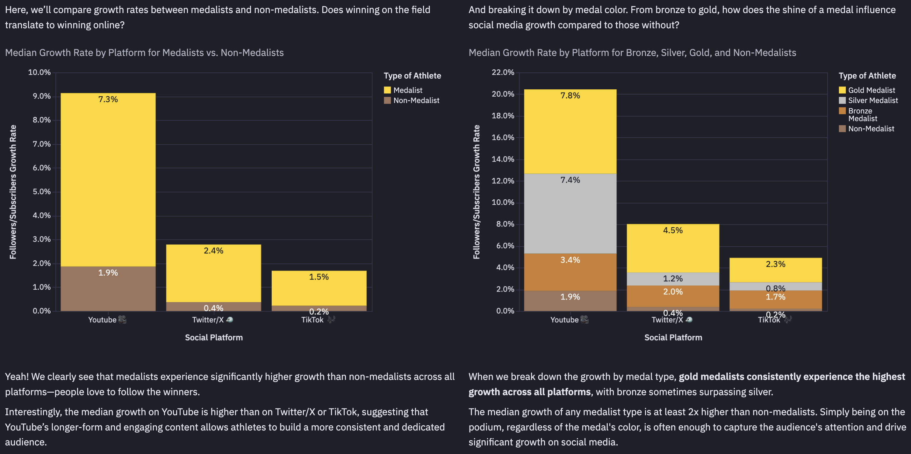
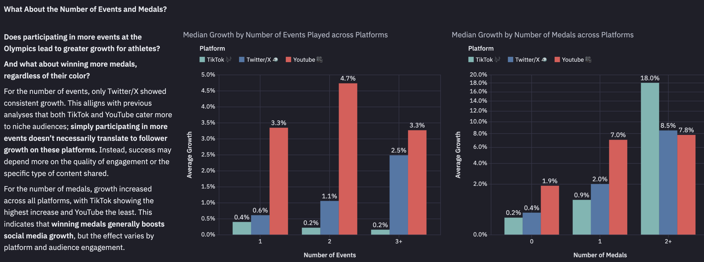
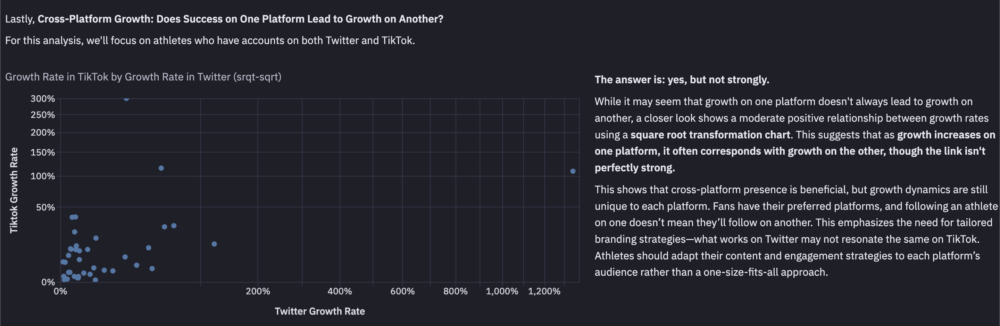
#### Sentiment Analyses
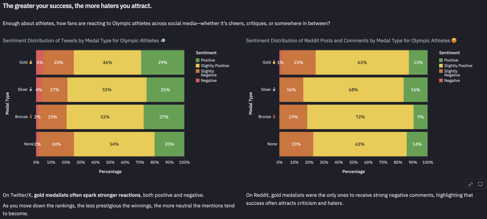
Thanks for going through these analyses with me! Now we have the fun part!
### Events and Results
#### Medal Table
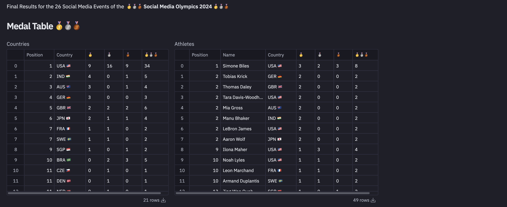
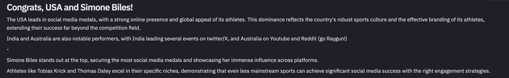

   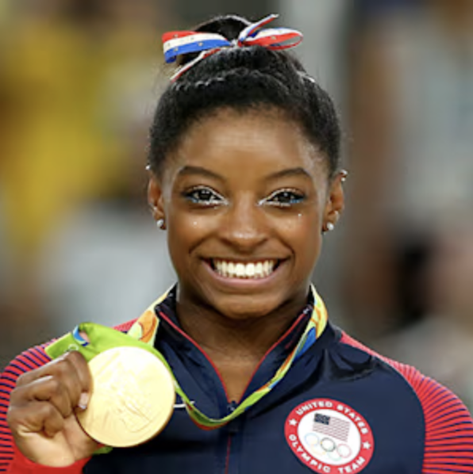

#### Instagram Events 📷
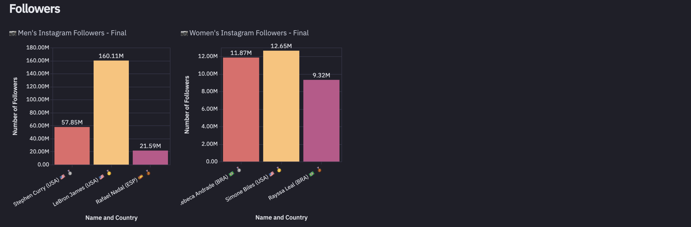
#### Tiktok Events 🎶
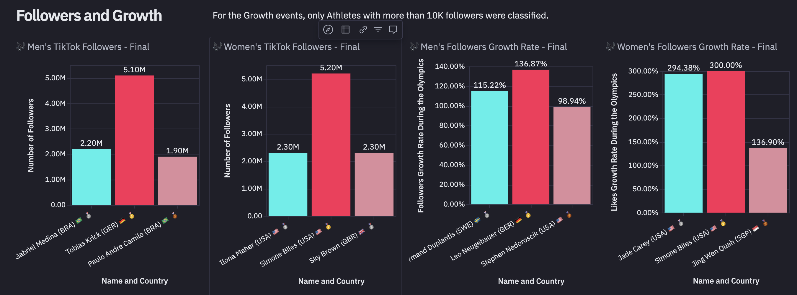
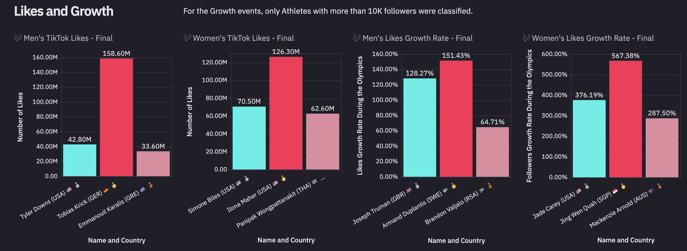
#### Twitter/X Events 🐦
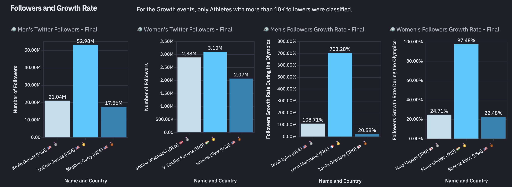
#### Youtube Events 🎥
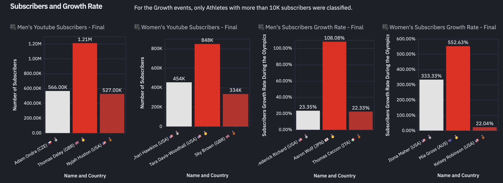
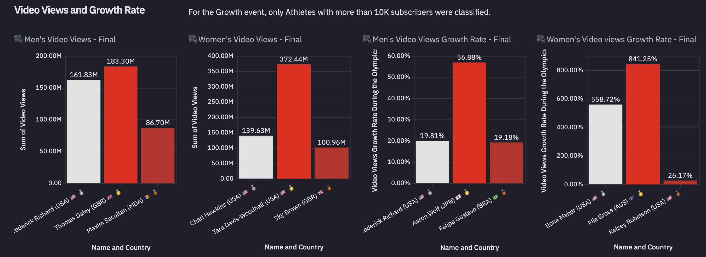
#### Mentions Events 🗣️
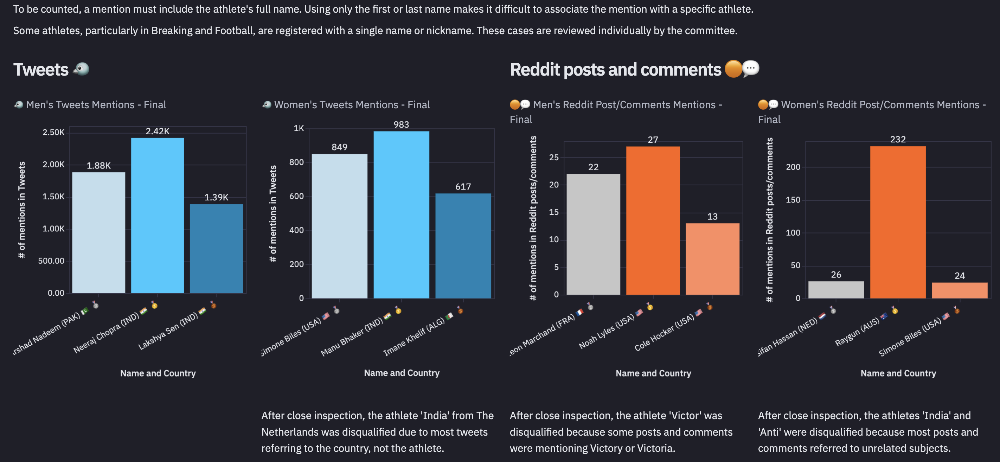
#### Disclaimer
All data was obtained around mid-August. So, it might differ from the athlete's current social media numbers.

## 🎉 Wrapping It Up

The Social Media Olympics 2024 was all about showing how athletes can shine online just as much as they do on the field. Here’s what we can conclude:

- **Different Platforms, Different Vibes 📸🐦🎶**: Instagram and Twitter/X are still where most of the action happens, but TikTok and YouTube are giving athletes, especially from smaller sports, a chance to reach new and younger fans. These platforms are great for those who can bring some personality and creativity to their posts.

- **Medals Mean More Followers 🥇🚀**: No surprise here—winning medals boosts your follower count. Gold medalists get the most love, but silver and bronze winners aren't far behind. Basically, if you make it to the podium, your follower count is probably going up!

- **It’s Not Just About the Big Sports ⚽🏀**: Sure, basketball and football athletes have tons of followers, but TikTok and YouTube are letting athletes from lesser-known sports get in on the action too. If you’ve got the right content and can connect with your audience, you can make waves no matter what sport you play.

- **Global Reach 🌎✨**: The U.S. leads the way in social media fame, but countries like Brazil and others in Europe are also killing it. It’s cool to see that no matter where you’re from, there’s a platform that can amplify your voice and connect you with fans worldwide.

- **Cross-Platform Isn’t Always a Thing 🔄**: Just because you’re big on one platform doesn’t mean it’ll carry over to others. Each platform has its own audience and quirks, so athletes need to tweak their game plan depending on where they’re posting.

- **Fans Have Feelings 😊😡**: The bigger the success, the louder the reactions—both good and bad. Gold medalists tend to stir up the strongest feelings, showing that being at the top comes with a spotlight that’s not always friendly.