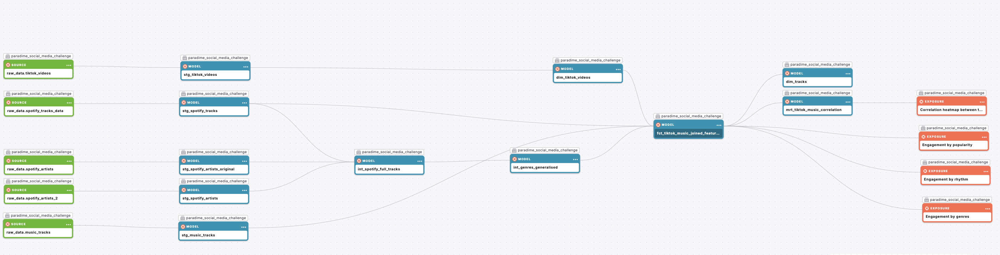
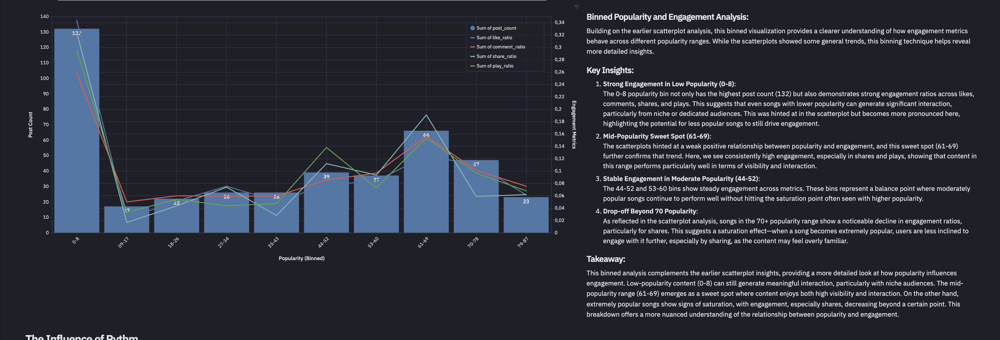

# Social Media Data Analysis - dbt™ Modeling Challenge

## Table of Contents
1. [Introduction](#introduction)
2. [Data Sources](#data-sources)
3. [Methodology](#methodology)
4. [Insights](#insights)
5. [Conclusions](#conclusions)

## Introduction
This project delves into how two critical factors—timing and music characteristics—affect TikTok engagement. First, we explore the impact of posting times, uncovering when TikTok content performs best throughout the day to maximize likes, comments, shares, and play counts. Then, we shift focus to music, analyzing how elements like rhythm, popularity, and genre influence user interaction. By combining insights from both the timing of posts and the musical features of content, this study aims to provide actionable strategies for boosting engagement and improving content performance on the platform.

## Data Sources
## Data Sources
- **Dataset 1: TikTok Dataset**  
  - Kaggle dataset with 1000 posts from 2020 Q4  
  - Includes various engagement metrics (likes, comments, shares, play counts), music data (Spotify and Apple), and author data.

- **Dataset 2: Extra Spotify Dataset**  
  - Due to incomplete Spotify data in the original TikTok dataset, I scraped additional Spotify data using their API. This additional data includes track popularity and musical features such as rhythm, loudness, and danceability.
<a href="Analysis/spotify_api_extract.py" style="font-size: 6pt; color: #0077cc;">Spotify extract script</a>

- **Dataset 3: Extra Author Dataset**  
  - An additional Kaggle dataset providing more detailed author information, used to join genres on.

### Data Lineage

## Methodology
### Tools Used
- **Paradime**: SQL and dbt™ development
- **MotherDuck**: Data storage and computing
- **Hex**: Data visualization and further transformation

### Applied Techniques
- **Data Cleaning and Preprocessing**  
  - Standardized data formats and handled missing values to ensure data consistency across all models.  
  - Removed duplicates to maintain data accuracy.
  
- **Feature Engineering**  
  - Created composite features such as **intensity**, **rhythm**, and **sound type** to capture musical characteristics beyond basic metrics.  
  - For example, **intensity** combines loudness and energy, while **rhythm** factors in danceability, positiveness, and tempo.

- **Binning and Quartiles**  
  - Utilized NTILE functions to divide data into quartiles based on features like popularity, rhythm, and intensity, providing deeper insights through segmented analysis.

- **Outlier Removal**  
  - Applied Interquartile Range (IQR) method to remove outliers that could distort engagement metrics, focusing on the most relevant data points.

- **Exploratory Data Analysis (EDA)**  
  - Explored data distributions, relationships, and trends. This included heatmaps, scatter plots, and line charts for initial insights.

- **Logarithmic Scale Transformation**  
  - Used logarithmic scales in visualizations to manage large variances and bring out trends that might be missed on linear scales.

- **Correlation Analysis**  
  - Created correlation matrices to measure the relationships between engagement metrics (likes, plays, comments) and music features. This helped in identifying key factors that influence user interaction.

## Insights

<a href="Analysis/tiktok_engagement_by_timeslot_ratio.sql" style="font-size: 6pt; color: #0077cc;">Engagement by timeslot source code</a>
  

<a href="Analysis/heatmap_engagement_by_timeslot.py" style="font-size: 6pt; color: #0077cc;">Engagement by timeslot (heatmap) source code</a>
  

  

<a href="Analysis/heatmap_engagement_by_music_characteristic.py" style="font-size: 6pt; color: #0077cc;">Engagement by music features (heatmap) source code</a>
  

<a href="Analysis/tiktok_engagement_by_genres_ratio.sql" style="font-size: 6pt; color: #0077cc;">Engagement by genres source code</a>
  

<a href="Analysis/trendline_scatter_popularity_vs_engagement.py" style="font-size: 6pt; color: #0077cc;">Engagement by Popularity (Scatter) source code</a>
  

<a href="Analysis/tiktok_engagement_by_popularity_ratio.sql" style="font-size: 6pt; color: #0077cc;">Engagement by Popularity source code</a>
  

<a href="Analysis/trendline_scatter_rhythm_vs_engagement.py" style="font-size: 6pt; color: #0077cc;">Engagement by Rhythm (Scatter) source code</a>
  

<a href="Analysis/tiktok_engagement_by_rhythm_ratio.sql" style="font-size: 6pt; color: #0077cc;">Engagement by Rhythm source code</a>
  
###Conclusions

