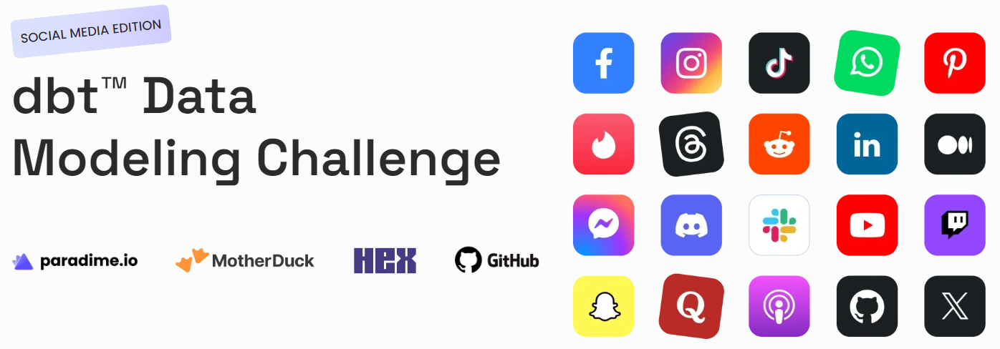
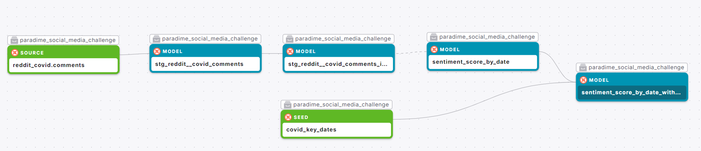
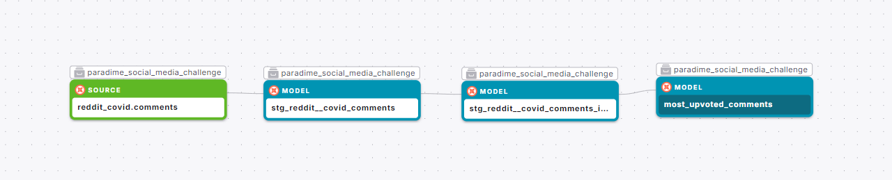
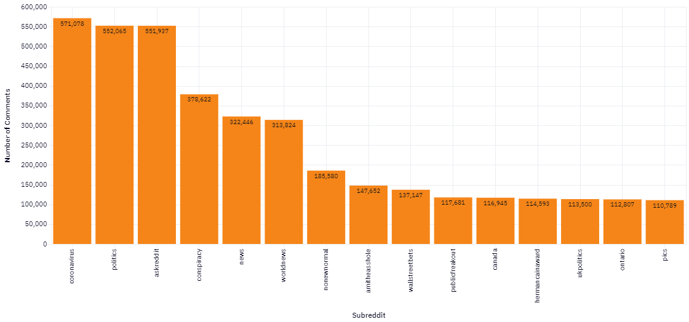
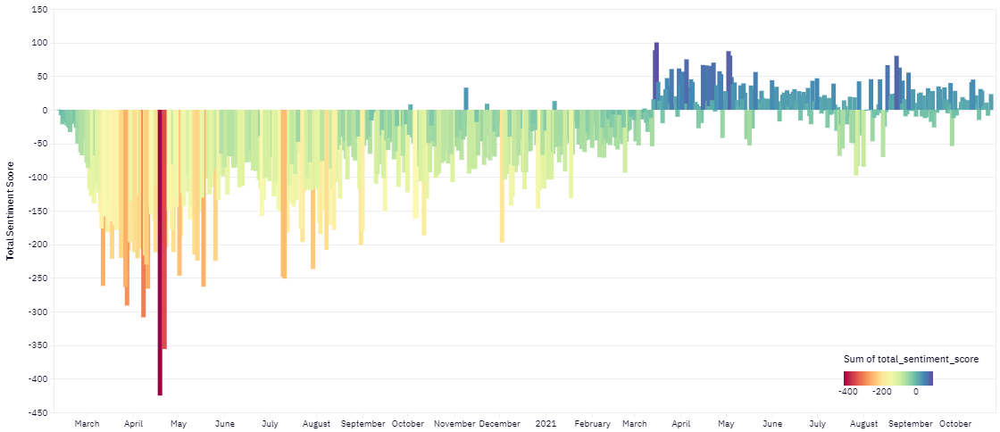
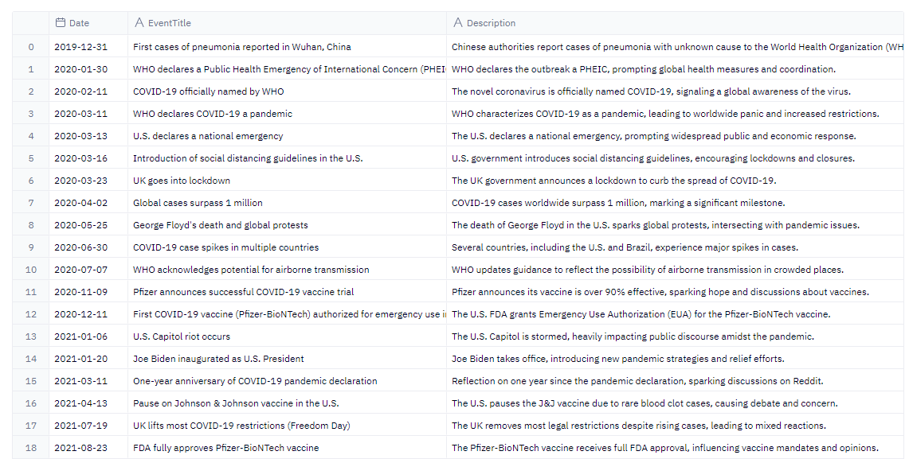
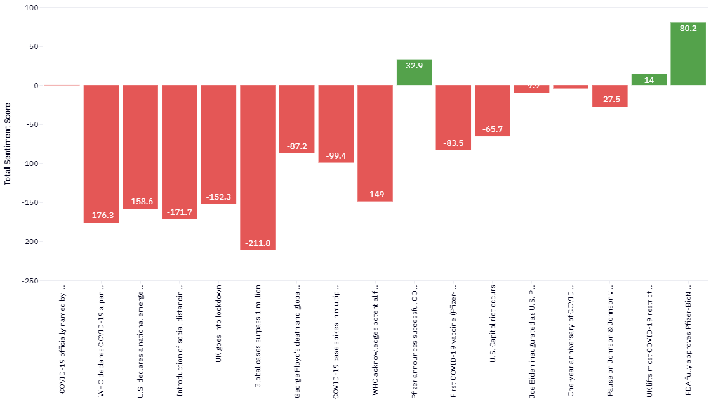
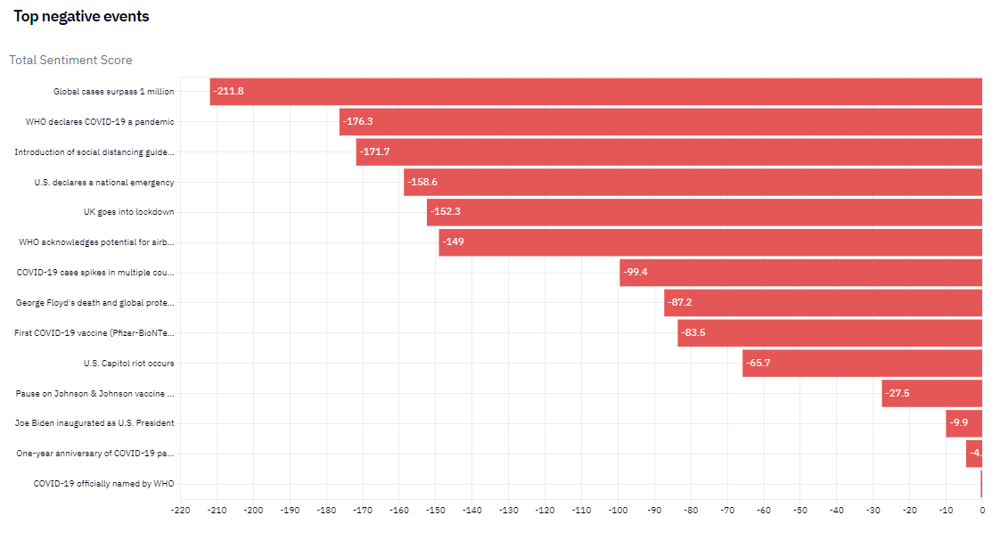
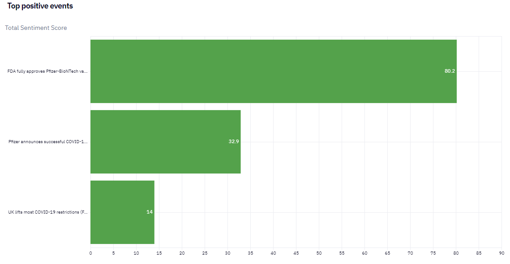

  

# Covid-19 Sentiment Analysis 

## :bookmark_tabs: Menu

1. [Introduction](#Introduction)
2. [Data Sources](#Data-Sources-)
3. [Data Lineage](#Data-Lineage-)
4. [Methodology](#Methodology-)
5. [Insights](#Insights-)
6. [Author](#Author)

## Introduction 🛈
TLDR -> Check this [HEX app](https://app.hex.tech/0f966a2f-3837-4926-8b38-07e7463ef805/app/4d121eb8-af7d-4dbd-b82c-f62436acb541/latest).    
Reddit, a popular social media platform, hosts a variety of user-generated content across numerous forums, where individuals discuss topics ranging from everyday life to global events. In this project we explore how sentiment on Reddit has evolved over time during pandemic and discover underlying reasons of sentiment score changes using cutting edge tools suchs as paradime.io for data transformation, MotherDuck for datawarehousing and HEX for analysis and visualization. Also, a public dataset containing a comprehensive collection comments mentioning COVID in their body text is used. Some terms that are good to know:

- Subreddit is a specific forum or community within Reddit dedicated to a particular topic, interest, or theme.
- Comment is user-generated response to a post or another comment within a subreddit.
- Sentiment Score: A sentiment score is a numerical measure of the emotional tone in text, ranging from -1 for negative sentiment to +1 for positive, with 0 indicating neutrality.
- Upvotes are positive votes that users to express approval or agreement with a post or comment.
- Downvotes are negative votes that users to express disapproval or disagreement.

## Data Sources 📂
**The Reddit COVID dataset**: The dataset contains a comprehensive collection of comments mentioning COVID in their body text respectively. The data consist of **17.7 million rows** and has a size of 6GB. You can find detailed information about the dataset [here](https://www.kaggle.com/datasets/pavellexyr/the-reddit-covid-dataset).

**Key events during covid**: A ChatGPT generated csv file that shows the important events with thier date and description.

## Data Lineage ⚙️
Here you can see the lineage of two dbt models used in the analysis to generate insights easily.

#### most_upvoted_comments

  

#### sentiment_score_by_date_with_events

  

## Methodology 🧮
The Reddit COVID dataset is uploaded to MotherDuck and then cleaned and transformed by using paradime.io to make it ready for analysis or visualization. On the otherhand, key events during covid dataset is generated by ChatGPT in CSV format with a prompt and it's created as a table in MotherDuck using dbt seed function in paradime.io. A final notebook is created in HEX for the analysis and visulaziton of the data and finally, a public HEX app is built from the notebook to present insights. 

### Tools Used 🔧
- Paradime: SQL and dbt™ development
- MotherDuck: Data storage and computing
- Hex: Data visualization
- ChatGPT: Used to get the key events during Covid-19 in CSV

## Insights 📈
### Popular Subredits

  

➡️During pandemic, Reddit users commented in many subreddits and shared their thoughts and experience. The subreddits **coronavirus**, **politics**, and **AskReddit** received the highest number of comments mentioning "covid" during the pandemic because they are directly related to COVID-19 updates, political discourse, and general community discussions, making them central hubs for pandemic-related conversations. The remaining subreddits, which are more niche or focused on specific topics, saw significantly fewer comments, indicating less overall engagement with COVID-19 discussions.

---
### Top 3 Comments - What people commented and others upvoted?
#### Comment 1

*"I just had to attend my own father's funeral via livestream 2 days ago.*  
*I’m 9 months pregnant and couldn’t take the risk.*  
*It’s hard and upsetting but my dad told me multiple times not to get sick before his passing.*  
*I try to see it as honoring his wishes."*

➡️This comment captures the heartbreaking reality of losing a loved one during the pandemic, where **difficult choices had to be made to keep everyone safe**. Despite the pain of not being there in person, the writer finds comfort in fulfilling her father's last wishes, showing how love and resilience can shine through even the darkest times.

---
#### Comment 2

*"As of today my wife is still sedated and on the ventilator with no signs of improving.  
There were a couple times were they tried to start weaning her off the ventilator but as soon as they've done that her oxygen level dropped   and they had to put her back on the ventilator full time.  
My wife has been sick before in the past quite a few times and she always fought through to get better but now after 3 weeks.  
I have come to accept that my wife may pass away and the peace I have about it is that I know without a shadow of a doubt that she will be going home to be with the Lord but I also do believe in miracles and I'm holding on to the chance that she may get healed but if not I am thankful for her I know we've been married for 8 years.  
So think about what I wrote and think about if this thing is a fake crisis."*

➡️This comment shows the heartbreaking struggle of a person watching their wife fight for her life on a ventilator, torn between hope for her recovery and the painful reality that she might not make it. Despite the fear and sadness, they find some comfort in their faith and the love they've shared, reminding others to **take the situation seriously** and not think of it as something fake.

---
#### Comment 3

*"Peter told the college students that they were no longer able to stay with the family as originally planned   because he couldn’t risk Matt’s grandparents getting exposed to COVID-19 or any other potential germs the group may have encountered.   
He gets his COVID-19 information right. It's a correct decision."*

➡️This comment reflects a difficult decision to prioritize the health of loved ones over previous plans, showing a strong sense of responsibility to protect vulnerable family members. It highlights the importance of making informed choices during the pandemic, even when they’re tough, and commends Peter for doing the right thing to keep everyone safe.

---
### Sentiment Score Evolution During Covid

  

  
This visual captures the rollercoaster of emotions experienced by users discussing COVID-19 on the "coronavirus" subreddit from March 2020 to October 2021. The sentiment score, calculated based on comments containing the keyword "covid," provides a fascinating glimpse into the collective mood and mindset of the online community during this unprecedented period.

#### A Journey Through the Pandemic:

1. **March to May 2020: The Height of Uncertainty and Fear**
   - During the initial outbreak of COVID-19, the sentiment score plummets deeply into the negative. This is reflected in the sharp drop, particularly in April and May, where the score falls below -400. The bright red and orange bars suggest a period of intense fear, uncertainty, and negativity as the world grappled with the sudden onset of the pandemic and its implications.
   
2. **June to December 2020: A Gradual Adaptation**
   - As the pandemic progresses into mid-2020, the sentiment score begins to show signs of stabilization, although still largely negative. The less intense yellow and light green bars indicate a shift from panic to a more measured response. People were starting to adapt to the "new normal," though challenges and negative sentiment persisted, perhaps due to the ongoing effects of lockdowns and rising case numbers.

3. **January to May 2021: Hope on the Horizon**
   - The new year brings a shift in sentiment. The bars gradually move closer to the zero line, and we even see positive scores starting to emerge. This period likely reflects growing optimism fueled by vaccine rollouts and a sense of hope that the end of the pandemic might be in sight. Comments during this time likely discussed the potential for recovery and a return to normalcy.

4. **June to October 2021: Mixed Emotions Amidst Recovery**
   - As we move into mid-2021, the sentiment becomes more balanced with frequent fluctuations between slightly positive and slightly negative scores. The green and blue bars indicate a community that is cautiously optimistic but still navigating the complexities of an ongoing global health crisis. Topics such as vaccine hesitancy, new variants, and reopening plans likely contributed to the mixed sentiments observed during this period.

#### Reflecting on the Community’s Experience:

This visual clearly shows how the sentiment of the "coronavirus" subreddit evolved in response to the different phases of the pandemic. From initial shock and fear to cautious optimism and ongoing challenges, this chart encapsulates the emotional journey of a global community navigating an unprecedented event. As we continue to adapt and move forward, understanding these sentiment shifts can provide valuable insights into public perception and the overall impact of COVID-19 on mental and emotional well-being.

---

### How did important events influence sentiment scores during COVID?
To answer this question, a key events table generated by Chat-GPT4 shown below is mapped with the comments based on their dates. 

#### Key events

  

---

#### Influence of Key Events on Sentiment Scores

  

  

At the onset of COVID-19, one significant event that heavily impacted global sentiment was the World Health Organization (WHO) officially declaring COVID-19 a pandemic. This announcement triggered widespread panic and led to stricter regulations worldwide. The situation worsened when global cases surpassed 1 million, causing a major wave of fear and anxiety in Reddit community. 

However, a pivotal event that shifted overall sentiment from negative to positive occurred when Pfizer announced its vaccine was over 90% effective, igniting hope and sparking widespread discussions about vaccination. By the end of 2021, the U.S. FDA fully approved the Pfizer-BioNTech vaccine, marking a moment of significant optimism—the date recorded as having the highest positive sentiment during the pandemic in many online communities.

---

#### Top negative events

  

---

#### Top negative events

  

  

## Conclusions
The analysis of Reddit comments during the COVID-19 pandemic reveals a fluctuating pattern of sentiment, closely aligned with key events and societal responses. Initially, sentiments were overwhelmingly negative, marked by fear and uncertainty, especially around the declaration of the pandemic and rising global cases. As time progressed and vaccines became available, there was a notable shift towards optimism, particularly following announcements of successful vaccine trials. However, challenges such as lockdowns, new variants, and vaccine hesitancy led to a mix of emotions throughout 2021. These sentiment shifts highlight the pandemic's profound impact on public mood, reflecting the balance between hope for recovery and ongoing anxieties. Understanding these emotional trends can offer valuable insights for addressing public concerns in future crises.

## Author

- [@ufukceyhanli](www.linkedin.com/in/ufukceyhanli)