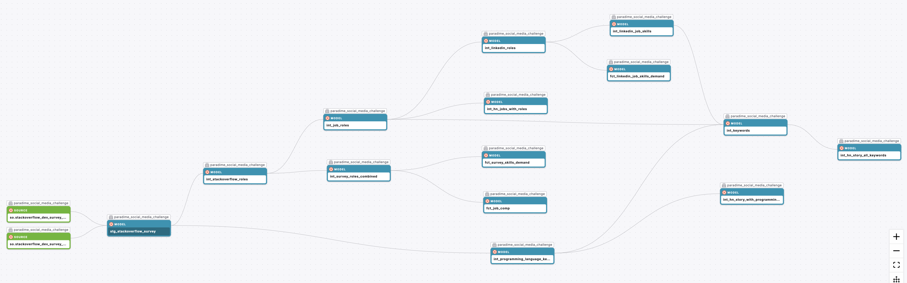

# Social Media Data Analysis - dbt™ Modeling Challenge

## Table of Contents
1. [Introduction](#introduction)
2. [Data Sources](#data-sources)
3. [Methodology](#methodology)
4. [Insights](#insights)
5. [Conclusions](#conclusions)

## Introduction
[Brief project overview and goals]

## Data Sources
- Dataset 1: [Name] - [Description]
- Dataset 2: [Name] - [Description]
- [Add more as needed]

### Data Lineage
[Insert data lineage image]

## Methodology
### Tools Used
- Paradime: SQL and dbt™ development
- MotherDuck: Data storage and computing
- Hex: Data visualization
- [Other tools]

### Applied Techniques
- [List key techniques and practices used]

## Insights

### Insight 1
- Title
- Visualization
- Analysis

[Repeat for additional insights]

## Conclusions
[Summarize key findings and their implications]