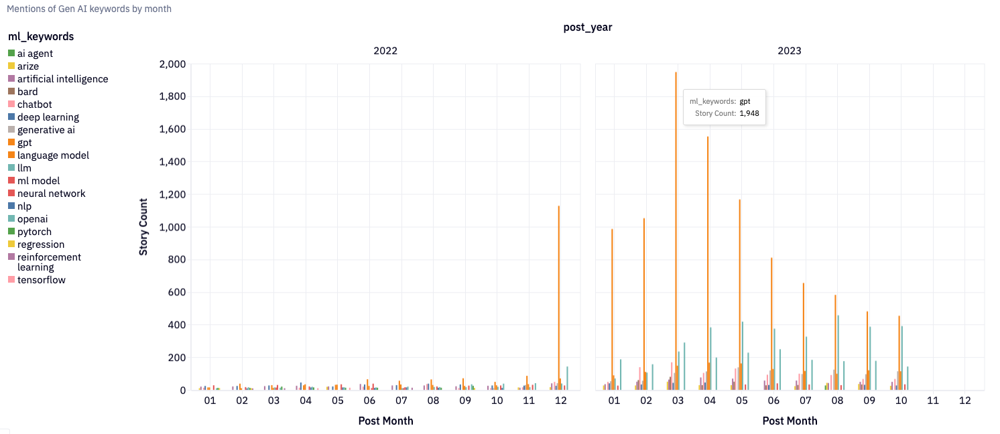
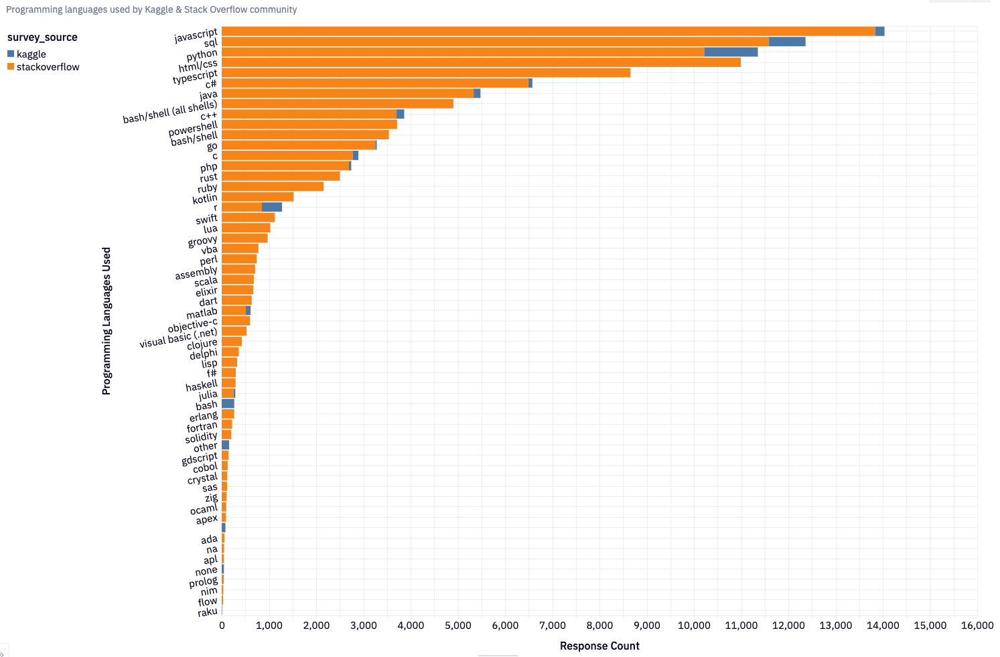
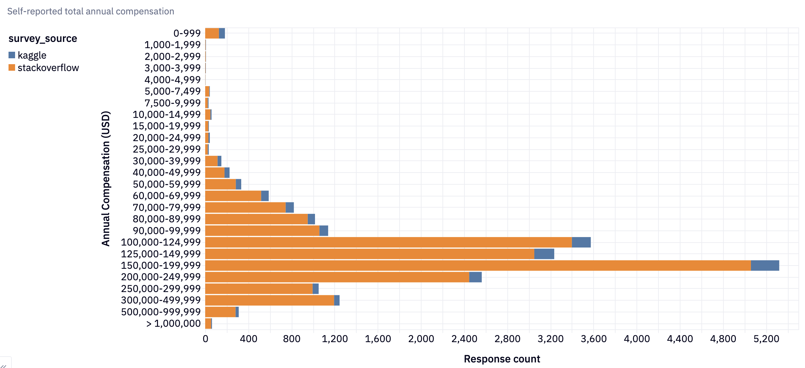

# Social Media Data Analysis - dbt™ Modeling Challenge

## Table of Contents
1. [Introduction](#introduction)
2. [Data Sources](#data-sources)
3. [Methodology](#methodology)
4. [Insights](#insights)
5. [Conclusions](#conclusions)

## Introduction

The recent job market left many people discussing online about seeking a new job and working on projects to build their portfolio. This project aims to determine if the tech communities in Hacker News, Kaggle, and Stack Overflow are discussing and working with tools and skills that are in market demand, as indicated by LinkedIn job postings.

Some of the questions we'll explore include:

* What data job roles are in demand?
* Are folks on Hacker News, Kaggle, Stack Overflow interacting with the job skills in demand?
* What tools and programming languages do they care about?
* What is the Hacker News community talking about when it comes to machine learning? How does this community feel about machine learning? 

## Data Sources

- Dataset 1: HackerNews - Social media data from Jan 2022 - Nov 2023, by [OpenPipe via HuggingFace](https://huggingface.co/datasets/OpenPipe/hacker-news)
- Dataset 2: [Kaggle Data/ML Survey](https://www.kaggle.com/competitions/kaggle-survey-2022/data#) - Survey data from 2022
- Dataset 3: [Stack Overflow Developer Survey](https://survey.stackoverflow.co) - Survey data from 2022 and 2023
- Dataset 4: Data Job Postings - Job postings data from 2023, by [Luke Barousse via HuggingFace](https://huggingface.co/datasets/lukebarousse/data_jobs ), filtered out for LinkedIn job postings. 

### Data Lineage
Hacker News

Kaggle

Stack Overflow

LinkedIn Jobs

Other models:
* `clean_job_roles` - macro to clean job roles to keep the titles consistent across data sources
* `consolidate_job_roles` - macro to consolidate redundant job roles. e.g. if pattern matching finds 'engineer' and 'software engineer' in a job post, choose 'software engineer'
* `get_job_experience_level` - macro to find experience level required of job position

In `scripts/`:
* `sentiment_analysis.py` - Python script to determine the sentiment of a post
* `nmf_topic_modeling.py` - Python script to perform topic modeling with NMF
* `unpivot_sentiment_scores.sql` - Not a model, but SQL used to pivot sentiment score table from topic modeling output

## Methodology
### Tools Used
- Paradime: SQL and dbt™ development
- MotherDuck: Data storage and computing
- Hex: Data visualization (SQL for analysis & Python `seaborn` library for visualization, `nltk` library for sentiment analysis, topic modeling)

### Applied Techniques

For consistency across data sources, I first narrowed down the dataset to the date range from Jan 2022 - Oct 2023 since the last available Hacker News data from OpenPipe was on Nov 1, 2023. 

- From Kaggle and Stack Overflow (SO), I aimed to generate a clean list of topics that these communities care about. Using Paradime, I cleaned the survey results, which proved to be a tedious process due to variations in data formatting. While both surveys asked the typical 'What is your job title' and 'What is your total yearly compensation', they may have different data intake formats to reconcile.
  - For example, for compensation: Kaggle provided inconsistent salary bins, while SO used an open input box for participants to enter salary details. I opted to clean up the manual entries and converted the numerics into categorical salary bins
  - The job title inconsistencies and ambiguous stratification of roles also required some intensive cleaning. For instance, Kaggle's survey grouped 'Machine Learning Engineer' and 'MLOps Engineer' as one category and 'Data Scientist' as another, while SO grouped 'Data Scientist' and 'Machine Learning' together. Since these two surveys served as the basis of the topics I'm interested in exploring, it took time to look into the data to decide how best to treat it. (In this case, I grouped the former as 'Machine Learning', and also grouped the latter as 'Machine Learning' because their salaries were higher than Kaggle's Data scientist role.)
  - Since these were survey questions, there were many questions where participants were allowed to select multiple answers. During cleaning, I had to wrangle these fields into an array and split them.
  - I also manually filled in some custom data roles and keywords to maximize post retreival when matching keywords, but they were mostly filtered out upon consolidating the topics to align with the survey topics.

- For Hacker News (HN), I aimed to narrow down stories and job posts relevant to tech readers and job seekers. Using the cleaned topics from Kaggle and SO, I identified matching topics and extracted posts that matched these topics/keywords. To guage the feelings towards these topics, I used sentiment analysis to explore the posts with related keywords. 

- Topic modeling with non-negative matrix factorization (NMF): To get a general understanding of what the HN community mostly posts about **without** categorizing them using pre-defined topics, I chose to find 10 topics (for interpretability) of interest. To visualize the weights across topics for topic modeling, I used `seaborn` to plot the heatmap. [See SQL query to unpivot the sentiment scores for this graph](./scripts/unpivot_sentiment_scores.sql)

## Insights

Note: The ML topics and keywords are defined by the Kaggle survey in 2022, which includes a variety of topics from machine learning frameworks, algorithms, enterprise products and tools, etc.

General data and tech keywords are defined by the Kaggle survey in 2022, Stack Overflow Developer survey in 2022 and 2023, and LinkedIn job posts from 2023, and it includes a variety of topics including programming languages, databases, data visualization tools etc

### Hacker News talked a lot more about machine learning in 2023 than in 2022

In general, people were posting around the same amount of content surrounding data and tech (see below) with a slight increase in activity in 2023. It seems this community also significantly slows down and posts less around the holidays (November and December months).

### Gen AI dominated the HN stories

From 2022 to 2023, there have been more than 11k posts mentioning `gpt` and the other common keywords mentioned were deep learning and Gen AI related (`arize` is potentially 'Arize AI',  an AI obervability tool for LLM projects.)

### March 2023 had the highest activity of 'gpt'-related posts

In 2023, the popularity of Gen AI surged in HackerNews. OpenAI's GPT-4 released on March 14, 2023. This upgrade introduced multimodal capabilities, and around the same time Microsoft integrated GPT-4 Turbo into its Copilot product for free. All these exciting new features seem to be a topic of interest for Hacker Rank, with nearly 2k posts mentioning `gpt`. In regards to ML related topics, it seems like ChatGPT is on this community's mind.

### Hacker News sentiment towards the top ML topics was mostly neutral

The average user sentiment towards the most popular ML topics at Hacker News over time was predominantly neutral.

March 2023 saw the highest positive sentiment towards `artificial intelligence`, where an average of 48% of the sentiment were positive in the related posts.

January of 2022 saw the highest negative sentiment towards `chatbot`, where an average of 23% of the sentiment were negative, and the next month in February saw the highest positive sentiment with an average of 45% of the sentiment being positive. That said, the overall sentiment of the posts across all months in 2022 and 2023 were neutral.

Note that the blank sentiments (see `generative ai` Jan - Apr) mean the posts returned non-meaningful text. For example, there was a post with just the title, 'neural networks in 1991'. When performing sentiment analysis, we remove non-alpha charaters, stopwords and punctuation, resulting in missing sentiment and hence gaps in the plot.

### Other than Gen AI-related topics, Hacker News also talked about deep learning and neural networks

Pytorch seems to be of higher interest than Tensorflow in the Hacker News community. Other topics of interest include NLP, reinforcement learning, and regression analysis. 

These topics come up again with NMF topic modeling, a good sign of the model converging and validating the presence of these topics in Hacker News:

Looking vertically through the heatmap at the weights, we can see that `deep learning` contributes most to Topic 2.

### The rest of the Hacker News tech community care about AI / language models, programming languages, open source and dev platforms, OS & tools, and human impact & research

* Topics 7 and 10 are about LLMs and AI
* Topics 5 and 6 are about programming languages (Python and Rust)
* Topic 9 are about tools like GitHub and open source, suggesting interest in a collaborative environment
* Topics 3 and 8 are about research, and human impact
* Topics 2 and 4 are about operating systems (Linux, Windows, MacOS) and developer tools

#### Not all words contribute to the topics equally

Notably, 
* `linux` contributes most to topic 2 (OS & dev tools)
* `scientist` contributes most to topic 3 (research & human impact)
* `developer` contributes most to topic 4 (OS & dev tools)
* `python` and `rust` contributes most to topics 5 and 6 (programming languages)
* `language` `model` contributes most to topic 7 (LLM & AI)
* `research` contributes most to topic 8 (research & human impact)
* `ai` and `generative` are the two words that contribute most to topic 10 (LLM & AI)

### Python and Rust are the top 2 programming languages mentioned in Hacker News stories

Javascript comes in as the 3rd most mentioned programming language in Hacker News.

The prevalence of these three languages stayed consistent in 2022 - 2023. `python` related posts peaked in March 2023, the same time as when `gpt` peaked in the machine learning keyword category. Perhaps the release of GPT-4 inspired more development in Python.

### Python, Javascript, Typescript, and Java are popular programming languages of choice in the Kaggle & Stack Overflow community

Stack Overflow (SO) folks' top 3 programming languages are Javascript, Typescript, and HTML/CSS. Kaggle's community prefer Python, SQL, and R. Kaggle is known being a platform that hosts data science competitions and provides datasets, so it makes sense that this community has a focus on data science tools. 

In general, aside from Hacker Rank's interest towards Rust, the three community share similar top 10 programming languages.

#### Stack Overflow community earns more than the Kaggle community in the US

Stack Overflow (SO) had more survey responses in total (162k responses vs Kaggle's 24k), and after filtering out for responses in the US, the number of responses dropped even more, which helps explain why there are more SO responses. Still, the proportion of high-earners (200k - 240k USD) is much higher in the SO community compared to Kaggle. Also note that self reported numbers always have a margin of error.

### Python is important to companies hiring for data roles, and Tableau, AWS, and Azure are the top 3 enterprise tools that jobs use

Python is the second most sought after skill (after SQL) in the job postings for data roles.

SQL is required of data engineer roles the most, followed by data analysts.

### Back-end, full-stack, embedded app developers use Rust

According to Stack Overflow survey participants, back-end and full-stack developers are the two jobs that use Rust. 

Among job postings that required Rust, the positions that most commonly seeked this skill are data engineer and data scientist.

Out of the 374 job posts seeking software engineers / engineers who are knowledgable in Python or Rust, 40% of jobs asked for Python, and only 4 jobs required Rust (and Python).

### LinkedIn's data-focused jobs seeked data analysts, data engineers, and data scientists

Despite Hacker News's enthusiam towards ChatGPT and OpenAI, there weren't a lot of machine learning roles compared to other data roles.

### 2022 saw more Hacker News job postings than in 2023, and most companies were hiring engineers, software engineers, full-stack developers

There are almost half as many machine learning roles posted in 2023 compared to 2022. There are more machine learning roles here than are listed in the LinkedIn job posts, though the numbers are much smaller compared to other roles.

### Both Hacker News and LinkedIn job posts share asks for cloud computing, as well as data related roles

 

Hacker News job posting topic modeling heatmap

LinkedIn job posting topic modeling heatmap

Rust seems to be in demand for Hacker News Jobs, as mentioned in Topics 5, 8, and 9. While both job boards asked for cloud, LinkedIn mentioned more specific platforms like AWS and Azure. The heatmap suggests that both job boards place an emphasis on remote/hybrid work (HN Topic 5; LinkedIn Topic 8). 

## Conclusions

The data roles in demand in 2023 were data analyst, data engineer, and data scientist. While the LinkedIn jobs focus on data-related roles, so do the Kaggle survey participants, as well as Hacker News as indicated by topics observed through topic modeling. 

The Hacker News (HN), Kaggle, Stack Overflow (SO) communities are generally interacting with the job skills that are in demand. HN Jobs and SO communities seem to lean more towards software engineering / engineering roles, so it would make sense to have a focus on Javascript, Typescript, Java, and Rust.

The HN community talked mostly about generative AI and ChatGPT in 2023, and their posts on average had neutral sentiment towards these topics. Aside from that they were also interested in deep learning/neural networks. If this community looks for data jobs according to their interest in gen AI and Python, then they would be interacting with the job skills in demand for the data roles. 

Additionally, since SQL, AWS, and Azure are top requirements in data roles, the HN community could benefit from having even more interest in these topics. However, their interest in Rust doesn't overlap requirements for most data roles.

All three communities displayed an interest in Python through their posts and survey responses, which aligns well with what companies require to fill data positions. 