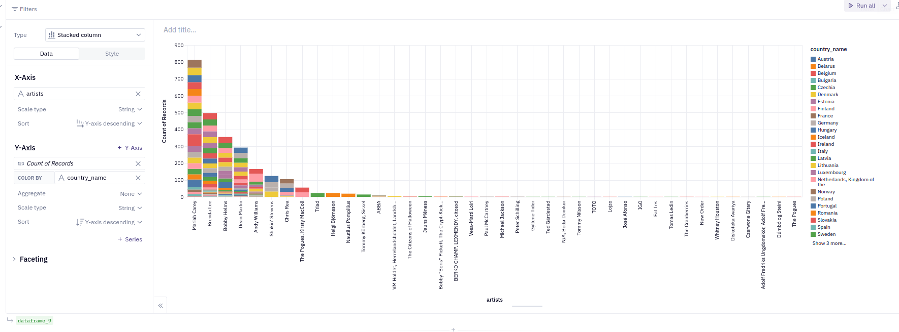
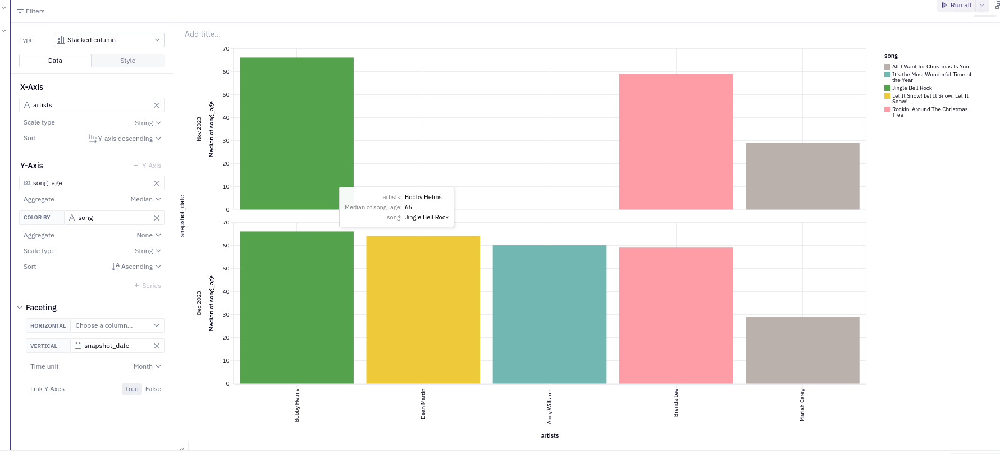

# Social Media Data Analysis - dbt™ Modeling Challenge

## Table of Contents
1. [Introduction](#introduction)
2. [Data Sources](#data-sources)
3. [Methodology](#methodology)
4. [Insights](#insights)
5. [Conclusions](#conclusions)

## Introduction
- Get spotify tops songs / artists and analyse their evolution in differents country : 
    - songs that are more than 5 years ago (release date) in top 10
    - songs that stayed more than 6 months in top 10
    - songs that are in top 10
    - songs that are in top 10 in more than 1 country
    - artists that are in top 10 in more than 1 country
- Use this suit of tools to present a light data stack on SaaS : 
  - ETL / ELT : dbt and duckdb
  - dataviz : Hex
  - storage or not #QueryEngine : motherduck

## Data Sources
- Dataset 1: [Songs performing in Spotify's Top 50 Song Charts Playlists for differents countries](https://www.kaggle.com/datasets/anxods/spotify-top-50-playlist-songs-anxods)

- Dataset 2: [top songs currently trending over 70 countries](https://www.kaggle.com/datasets/asaniczka/top-spotify-songs-in-73-countries-daily-updated)
- Dataset 3: [ISO-3166-Countries-with-Regional-Codes](https://github.com/lukes/ISO-3166-Countries-with-Regional-Codes/blob/master/all/all.csv)

### Data Lineage

## Methodology
### Tools Used
- Paradime: SQL and dbt™ development
- MotherDuck: Data storage and computing
- Hex: Data visualization
- duckdb for Inserting data from local files into motherduck (create table as ... from read_csv_auto('/tmp/file_*.csv'))

### Applied Techniques
- SQL, dbt to get facts and dims :
  - dim_songs : lists of songs from both spotify's datasets
  - dim_artists : lists of artists from both spotify's datasets
  - dim_countries: list of country form iso code countries
  - *missing similarity for artists and countries 's dimension to unify. 
- SQL, dbt to get base table :
  - songs_stayed in top10 in more than one country by snapshot date
  - more than five year old songs in top10 by country and by snapshot date
  - songs that stayed in top 10 for 6 months or more
  - songs in top 10 by country and by snapshot date
  - songs in top 10 in more than one country by snapshot date
- SQL, dbt to get insights :
  - Every insights is in analyses dbt's folder

## What is the period for old songs to be in top playlists ?

### Insight 1
- top songs that are more than 25 years old by country region

- the region where old songs are listened is the Europe. medium age of songs is around 20 years old

### Insight 2
- Who is the artists in Europe with more than 25 years old songs in top playlists ? (you certainly already know)

- Yeah, it's Maria Carey. Because of the dataset, Maria Carey and her Christmas'song is always in top playlists on spotify (like other musics platforms)

### Insight 3
- Does all countries in Europe have Maria Carey as first top retro's songs ?

- We have Belarus where Nautiluse Pompiius take more than 75% about the count of position in all playlists. But we can quickly see that Maria Carey's song is over all countries in Europe

### Insight 4
- What is the theme for top old songs in all region ? 

- By the picture, we can confirm that the :
  - "All I Want for Christmas is You" from Mariah Carey is in top songs in every region
  - "Let It Snow! Let It Snow! Let It Snow!" from Dean martin is like the first one but without Africa region
  - "It's the Most Wonderful Time of the Year" from Andy Williams is like the second one
  - "Jingle Bell Rock" from  Bobby Helms is like the last one
- Top old's song came back alive when Christmas arrives

### Insight 5 
- Olds songs more than 25 years old on more than 15 countries 's top playlists are essentially on Christmas Period :

- Christmas implied in all countries a big increased of retro's populars christmas's songs 
- Here I used two kpi_facts, 1 to get olds songs and the other focusing on which songs is popular in more than 1 country

## Conclusions
- By lack of time, I choose this simple example. 
- I focused on old songs.
- On spotify API, we can see that we can classify music with more attributes (loudness, instrumental, etc...). From theses attributes, maybe we can find some keys characteristics. Much more analyses can be done.
